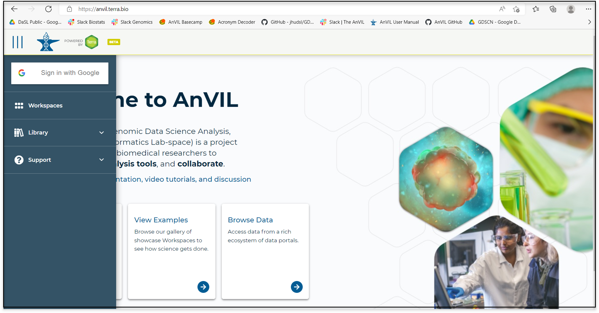
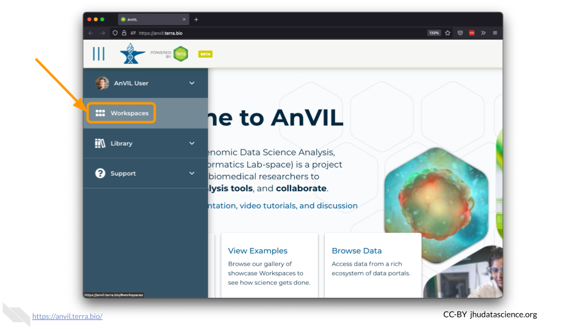
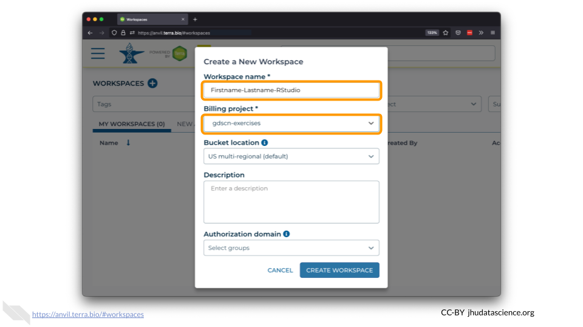

# (PART\*) BEFORE YOU START{-}

# Sign in

You need to sign into Terra with your Google account to allow your instructor to add you to projects and/or Workspaces associated with your specific class. This is the only way you can launch applications and perform computations on AnVIL. 

You can access Terra by going to [anvil.terra.bio](), or by clicking the link on the AnVIL home page. Sign in using the drop-down menu in the upper-left-hand corner.

# Create a workspace

On AnVIL, you use Workspaces to configure and run analyses and share results. Workspaces support interactive analysis with RStudio, Jupyter notebooks, Bioconductor and Galaxy. Workspaces can also save the output generated by running an analysis with a Workspace’s associated “cloud environment.” Check out [https://anvilproject.org]() to learn more about everything you can do within a Workspace.

In the drop-down menu on the left, navigate to “Workspaces”. Click the triple bar in the top left corner to access the menu. Click “Workspaces”.

Click on the plus icon near the top of left of the page.

Name your Workspace and select the Billing Project as indicated by your instructor. Do not change the Bucket Location or Authorization Domain. You can add a Description if you wish.

Click “CREATE WORKSPACE”. The new Workspace should now show up under your Workspaces.

