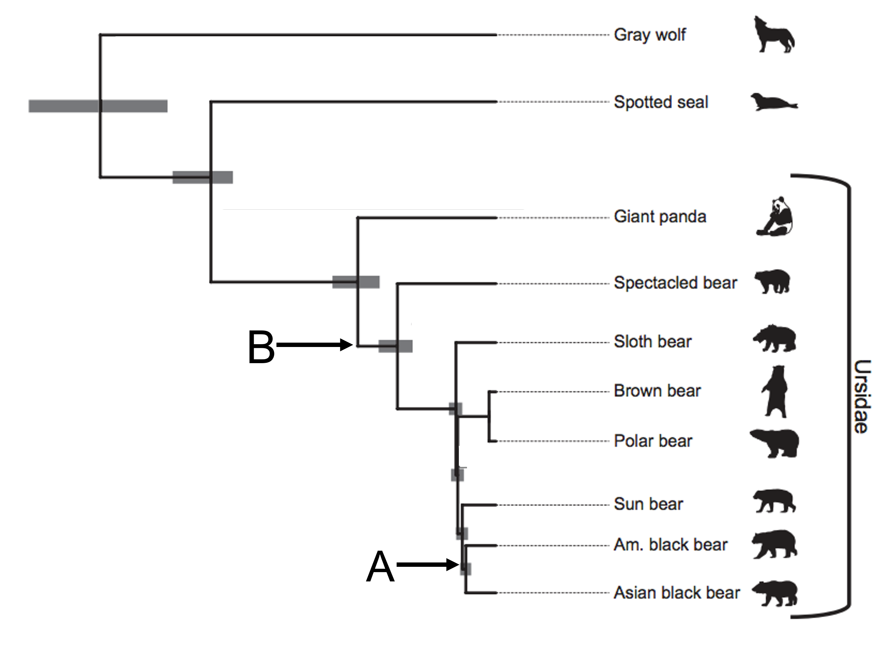

# (PART\*) TREE THINKING {-}

```{r, include = FALSE}
ottrpal::set_knitr_image_path()
```

# Phylogenetics basics

## How to read a phylogenetic tree

A phylogeny, or phylogenetic tree, is a diagram that shows the evolutionary history and relationships among or within groups of organisms. Phylogenetics was traditionally a somewhat obscure field in which systematists (biologists concerned with arranging organisms into a tree that showed their ancestral relatedness) arranged related living organisms at the “tips” or “leaves” of the tree, and made “branches” to connect different organisms back to putative ancestral organisms.

Here's a phylogeny of the family Ursidae (the bears).



In this tree, all the extant (or currently living species) are at the tips on the far right side of the phylogeny. Inferences about how the bear species are related become apparent as you move away from the tips down the branches. When two branches meet at a node (as they do at point A), you can assume the species at the tips of those branches share a common ancestor. For example, this phylogeny of the Ursidae indicates that American black bears and Asian black bears share a common ancestor (indicated by the node at point A). However, we don’t _know_ what the common ancestor is for certain, we are just inferring based on similarities between the species that exist today.

Nodes that are closer to the tips indicate species that are more closely related (and thus indicate a more recent common ancestor than nodes farther away from the tips). American black bears are more closely related to Asian black bears than to sun bears, because the American black bear branch connects to a node shared by the Asian black bear branch before it connects to a node shared with the sun bear branch. According to this phylogeny, the evolutionary distance between the American black bear and the sun bear _is the same_ as the evolutionary distance between the Asian black bear and the sun bear, even though the American black bear label is closer to sun bear than the Asian black bear label is. **In phylogenetic trees, relatedness is expressed by the distance to a common node between two species, NOT by whether the labels are near each other.**

Although this is a phylogeny of the Ursidae, you might have noticed there are two branches belonging to the gray wolf and the spotted seal, neither of which is a bear. These two species are included as outgroups. Outgroups are taxa that are only distantly related to the group of interest and serves as reference points for determining evolutionary changes.

## Branch lengths

Branch lengths (the distance between two nodes, or between a node and a tip), may or may not be indicative of the passage of a particular amount of unit time. It depends on how the tree was inferred (we infer phylogenetic trees, we don't make them). If the tree is created by parsimony or neighbor-joining methods, the branches simply indicate that there was one (or more) change from the ancestor to the descendant.  If the tree was created using maximum likelihood methods, the branch lengths represent how many genetic changes occurred over time.

Regardless of how the trees are constructed, they are estimates of what we think happened historically.  Each estimate contains within it implicit assumptions about rates of mutation accumulating, likelihood of different types of changes being more common (transitions vs. transversions, for example), and so on.  The tree is our best guess as to the history of the organisms on it, but it is only a guess.


::: {.fyi}
At one time, only morphological data could be used to make these trees.  Thus, phylogenetic trees might have been based on similarities of bone structures, or fur types, or other gross physiological features.  Even though the trees were called “phylogenetic” trees, they were not based on genetic data.

Now, phylogenetic trees are generally based on DNA sequence (for closely related species) or amino acid sequences (for more distantly related species).  Furthermore, the trees are generally based on several genetic loci, rather than on the whole genome.  This is changing, with next generation sequencing and advances in computing power.  Nevertheless, at present most phylogenetic trees are “gene trees” rather than “species trees,” and it is important to remember that selection or drift on a particular locus can influence a tree so that it reflects the history of the gene, but NOT the history of the species
:::

# Visualizing trees in R

## Creating a Newick object

Computer programs use the Newick tree format for phylogenetic trees. This format uses a series of parentheses, commas, and colons to store information about evolutionary relationships. 

  * (A,B) indicates a pair of taxa that form their own group, or _clade_
  * ((A,B),C) indicates the next most closely related taxon to the A-B clade is taxon C
  * (A:5,B:7) tells the program (and us!) the length of the branch connecting each taxon to the node. In this case, the branch length between the node and A is 5 and the branch length for B is 7. The total distance between A and B is 5+7, or 12.
  * ((A,B),C)); tells the program the tree is complete. If the semicolon is missing at the end, the program will keep looking for information on another taxon.

For this exercise, we are going to create an R object in Newick formula that illustrates the relationships among several species of mammals.

```{r, echo=FALSE}
install.packages('ape')
install.packages('phytools')
install.packages('nlme')
```

```{r}
#ANVIL:install('ape')
#ANVIL:install('nlme')
library(ape)
library(nlme)

mammal <- read.tree(text = "((raccoon:19.19959,bear:6.80041):0.84600,((sea_lion:11.99700, seal:12.00300):7.52973,((monkey:100.85930,cat:47.14069):20.59201, weasel:18.87953):2.09460):3.87382,dog:25.46154);")

mammal
```

We now have a phylogenetic tree loaded into R. 

::: {.fyi}
Why is it called Newick format?

This is what Joe Felsenstein, one of the giants of the phylogenetic field, says: 
"The Newick Standard was adopted 26 June 1986 by an informal committee meeting convened by me during the Society for the Study of Evolution meetings in Durham, New Hampshire and consisting of James Archie, William H.E. Day, Wayne Maddison, Christopher Meacham, F. James Rohlf, David Swofford, and myself. (The committee was not an activity of the SSE nor endorsed by it). The reason for the name is that the second and final session of the committee met at Newick's restaurant in Dover, New Hampshire, and we enjoyed the meal of lobsters. The tree representation was a generalization of one developed by Christopher Meacham in 1984 for the tree plotting programs that he wrote for the PHYLIP package while visiting Seattle. His visit was a sabbatical leave from the University of Georgia, which thus indirectly partly funded that work."
:::

## Drawing trees

It is quite difficult for humans to quickly interpret the relationships and branch lengths in the Newick format. Luckily, R (and other phylogenetics programs) can convert Newick formats into a more understandable form.

```{r}
plot(mammal, type="unrooted")
#this can also be written as plot(mammal, "u")
```

You've inferred an unrooted tree. It probably looks a bit different than trees you've seen before (including the one in the previous section); most trees are displayed in a rooted form. We can do that by declaring an outgroup and specifying that we want to draw a phylogram.

```{r}
mammal.rooted <- root(mammal, outgroup = c('monkey','cat'))

plot(mammal.rooted, type="phylogram")
#alternatively, you can use the command: plot(plot(mammal_rooted), as phylogram is the default type
```

Now the tree looks more like the Ursidae tree we examined earlier. The order of the tips is partly determined by the order in which we wrote the taxa in our Newick format. We can change the order of the tips and still have the same tree.


```{r}
mammal_B <- read.tree(text = "(dog:25.46154,(raccoon:19.19959,bear:6.80041):0.84600,((seal:12.00300,sea_lion:11.99700):7.52973,((monkey:100.85930,cat:47.14069):20.59201, weasel:18.87953):2.09460):3.87382);")

mammal_B.r <- root(mammal_B, outgroup = c('monkey','cat'))

plot(mammal_B.r, type="phylogram")
```

Clades can rotate freely around nodes without changing the relationships among the tips. Although the "dog" label is closer to "sea lion" in our first tree, the evolutionary distance between the two is the same, because we trace through the same nodes to find their common ancestor.

::: {.fyi}
QUESTIONS

1. Based on the unrooted tree, why did we use "cat" and "monkey" as our outgroups for the rooted tree?

2. What is the total branch length between "sea lion" and "seal"? (You will need to look at the tree in Newick format.)

3. Does "raccoon" share a more common recent ancestor with "weasel" or with "sea lion"?

4. Which nodes on the first tree (`mammal.rooted`) were rotated to create the second tree (`mammal_B.r`)?
:::

## The `phylo` class

When we use the `ape` package, R converts a tree in Newick format to an object of the `phylo` class. This is basically a list of four dataframes.

```{r}
str(mammal.rooted)
```

Each dataframe holds information about some part of the tree.

_edge_: the number of steps needed to connect two tips. It's easiest to think of each branch as an edge. 

_edge.length_: the length of each corresponding edge, or branch

_Nnode_: the number of nodes in the tree

_tip.label_: the tip names (the taxa)


```{r}
sessionInfo()
```

