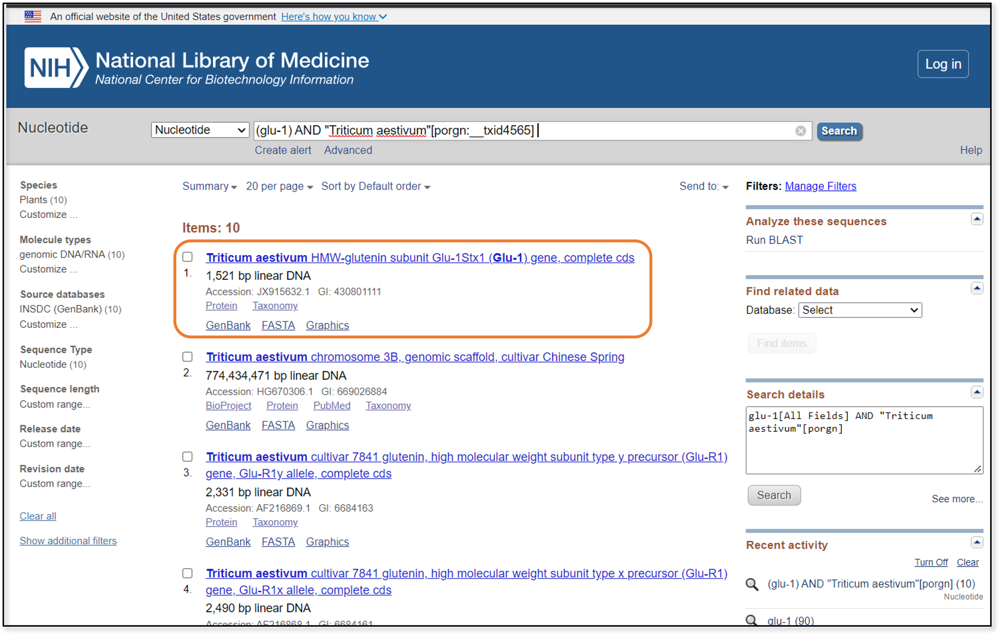
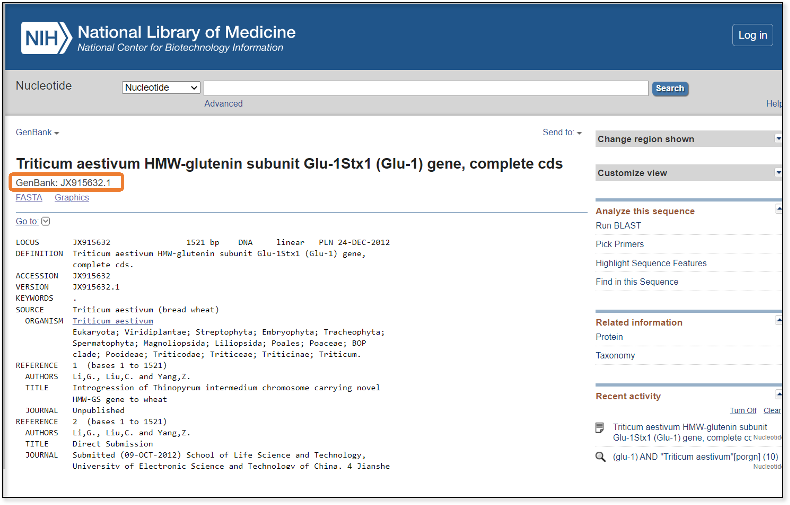
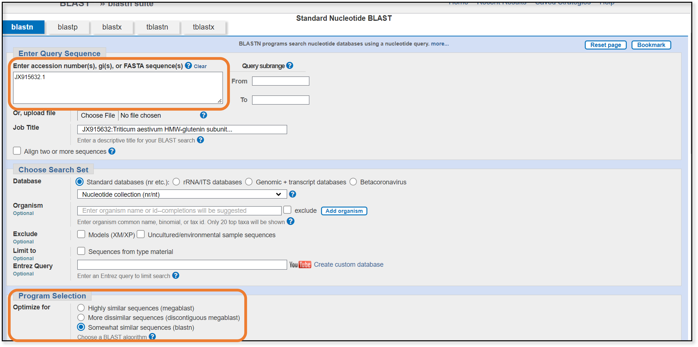
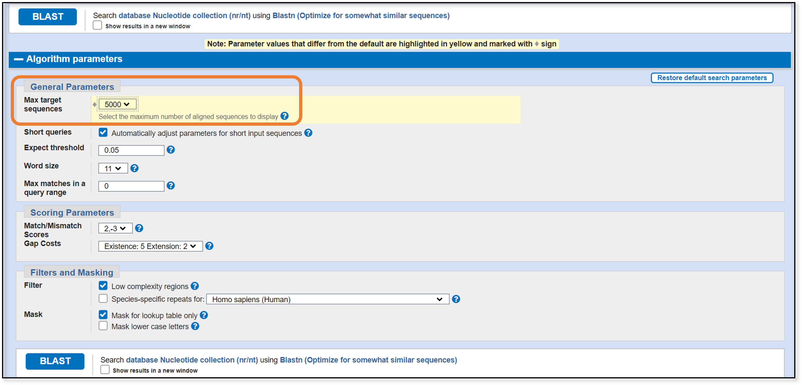
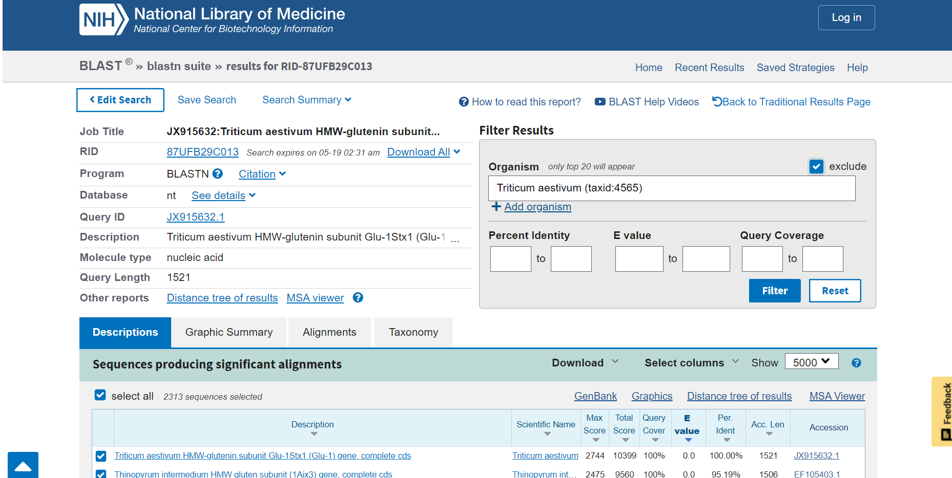
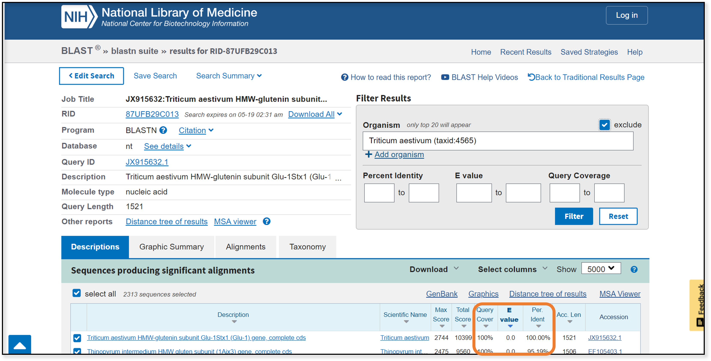
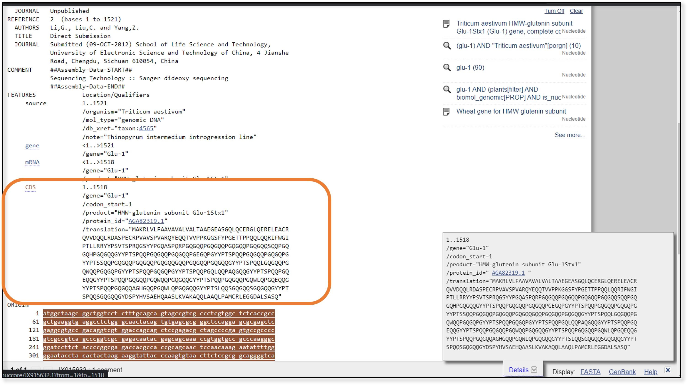
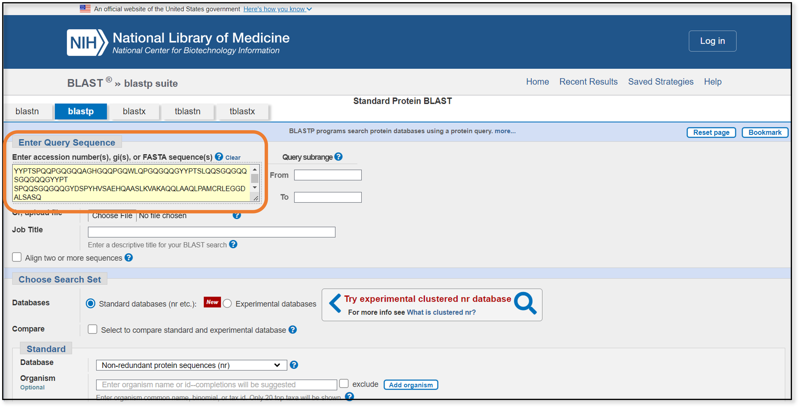
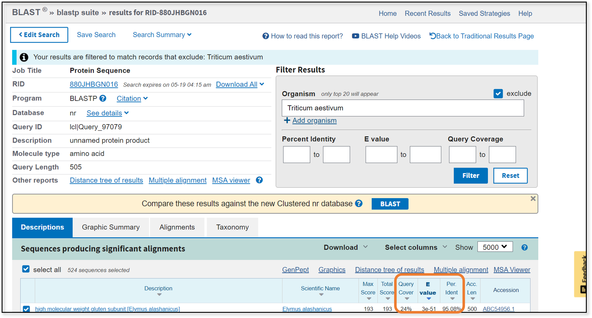
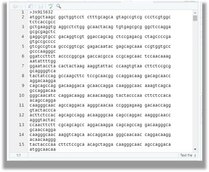

# (PART\*) GETTING SEQUENCES {-}

```{r, include = FALSE}
ottrpal::set_knitr_image_path()
```


# What sequences should I choose?

Phylogenies are only as good as the data used to infer them, so it's worth it to the spend some time carefully choosing the genomic regions and samples you will use. Good planning from the beginning will save you headaches further downstream. 

First, you should ask yourself: **what information are you hoping to gain from the tree?** Are you hoping to reconstruct the history of organisms, or the history of a region of DNA, or the history of a protein? The answer will guide your choice of sequence and samples. 

_For closely related species in which you might hope to figure out some sort of information about the divergence between the species_ (including the timing of the divergence), you would use areas of the genome known to accumulate changes rapidly (non-coding regions that also do not have functionality, or whose functionality is not easily changed by changes in the DNA base sequence).   Some examples of rapidly changing genetic regions include the mitochondrial control region, the wobble base on mitochondrial coding regions, and nuclear introns. It is also important to use “dense taxon sampling” among closely related species because any small change can seem disproportionately important in a recent divergence. Having multiple individuals sampled from each phylogenetic unit of interest (could be species, subspecies, or populations) helps to compensate by showing the genetic divergence within a group. This within-group divergence can then be accurately compared to the genetic divergence between two groups.

_For more divergent species and comparisons_, you use areas of the genome that do not change as rapidly.  For example, if you wanted to do a survey of the placental mammals, you could choose a gene region that is under enough selection pressure that it mutates more slowly than the regions you would choose for closely related species. 

_If you are examining the relationships among deeply divergent species, or when the base-pair signal is completely swamped out over time_, you might search for amino acid sequence similarities instead of DNA sequence similarities. Because of wobble, amino acid sequence can remain the same even when bases change. Sometimes amino acids of similar size/charge/shape can be substituted for others, which would result in a complete change in base pair sequence (and loss of ability to find similar sequences), but allows for finding similarities through amino acid sequence. Even when using protein sequence, it is often helpful to extract the coding sequence (once similar protein sequences have been found), because that adds extra information to fine tune the phylogenetic analysis.  This technique can also be used when the primary goal is to trace the history of a particular gene (when the changes in the gene itself are of interest.)

::: {.notice}
To attempt a reconstruction of the evolutionary history of organisms, you really should use multiple lines of evidence and not rely solely on genomic data. For example to reconstruct primate evolution, one looks at the fossil record, molecular divergence, and also phylogeographic evidence (how these things map onto our understanding of the geography of the earth at various crucial time points along primate evolution). Examples of phylogeographic evidence include understanding when terrestrial (land-based) organisms might have been cut off from each other due to the formation of a river or lake, the eradication of a land bridge by melting glaciers and a rise in the earth’s temperature (which raises the sea level).

Alas, for this book, we are limited to only using genomic data.
:::


# Finding sequences in GenBank

## Identifying a query sequence on GenBank

For this book, we will use _Glu-1_ sequences from a variety of species to infer our tree. _Glu-1_ is a gene that encodes one of the subunits used to make gluten in plants like wheat. We will use this gene to reconstruct some of the deeper phylogenetic relationships among the grasses.

We're going to temporarily leave AnVIL and RStudio and head to [NCBI's](https://www.ncbi.nlm.nih.gov/) website.


We start by searching for _Glu-1_ sequences in the NCBI nucleotide database. At the top of the website, use the pulldown menu to choose "Nucleotide" and enter "glu-1" in the search bar.


You might notice that this returns thousands upon thousands of possible sequences. While it's nice having choices, having _too_ many results makes it difficult to know where to start. Instead, we're going to narrow down our sequence choices by specifying that we want _Glu-1_ sequences from common wheat, or _Triticum aestivium_. This is a good starting point, since we know that common wheat plants make the gluten protein, so the genome should contain _Glu-1_.



The first hit (at least from when this guide was created) is exactly what we're looking for - the complete coding sequence for the high molecular weight glutenin subunit, the _Glu-1_ gene. If we click on the link at the top of the entry, we can go to the GenBank page for this particular entry. 



This page contains a lot of information about the sequence, including which research group generated it, if the sequence was used in published research, and the full taxonomy of the sample. At the top, we also find the _accession number_, or the unique ID assigned to this particular sequence. Highlight and copy the accession number - this is what we will use for our next step, a BLAST search.

## blastn

NCBI created a tool that allows us to use the **basic local alignment search tool** (**BLAST**) algorithm to find sequences similar to our query sequence (in this case, the _Triticum aestivium_ sequence we identified above). Here's a link for NCBI's web tool: [BLAST](https://blast.ncbi.nlm.nih.gov/Blast.cgi?PROGRAM=blastn&PAGE_TYPE=BlastSearch&LINK_LOC=blasthome).

There are many tutorials on how to use BLAST (including NCBI's [own](https://www.ncbi.nlm.nih.gov/Class/BLAST/blast_course.short.html)), so this section is going to focus primarily on the logic behind choosing sequences for phylogenetic analysis, not just the steps.

Once you open the BLAST webpage, you have five options for searching (the tabs at the top of the page). Which method you choose depends on your query sequence. We're going to work with two of them: _blastn_, which identifies DNA sequences that are most similar to the DNA (or nucleotide) query sequence; and _blastp_, which does the same for protein sequences.




For the blastn search, all we need to do is paste the accession code from earlier into the search box and change our program selection to somewhat similar sequences (blastn). Next, let's go down to the bottom of the page to the algorithm parameters section.





We need to change the max number of target sequences (the maximum number of sequences for our search to return). Given how rapidly the size of the GenBank databases are growing, leaving this value at 100 means we will miss a lot of sequences that we might otherwise want to see. For now, we can leave the other parameters as the default settings. The click the BLAST button on the bottom left.





It can take a couple of minutes for the blastn search to finish. When it does, a webpage similar to the figure above will open. On the right side of the screen, we have the option of applying additional filters to our search. Because we are interested in looking at the deeper phylogenetic relationships among the grass family, we don't necessarily want any additional _Triticum aestivium_ sequences, so we will filter them out. That leaves us with over 2,000 other sequences from which to choose our taxa. (If you were interested in more shallow phylogenetic relationships, choosing multiple sequences from the same taxa, or _dense taxon sampling_, is a good decision.)





There are three quality-control statistics at which we want to look. 
  *_query cover_: the amount of overlap between our query sequence and the newly-aligned sequence; larger is better
  *_E value_ (expect value): the number of hits expected by chance; like _p_-values, a lower number is better
  *_per ident_ (percent identity): the percent similarity between the two sequences; larger is better

We can filter or sort on any of these statistics. At this point we need to really look at the aligned sequences and decide which ones we want to use. 

There are quite a few samples from a variety of grass species that show good overlap, low E values, and high percent identities. Since we have options, we will prioritize choosing samples with complete coding sequence whenever possible (and avoid any sample labeled "pseudogene", since that isn't the actual _Glu-1_ gene sequence).

We will focus on these 9 sequences (in addition to the common wheat sequence we identified earlier):

  * EF105403.1, _Thinopyrum intermedium_ (intermediate wheatgrass)
  * DQ073553.1, _Leymus racemosus_ (mammoth wild rye)
  * EF204545.1, _Lophopyrum elongatum_ (tall wheatgrass)
  * AJ314771.1, _Secale cereale_ (rye)
  * FJ481569.1, _Henrardia_ (a genus of Asiatic wheatgrass)
  * DQ073533.1, _Agropyron cristatum_ (crested wheatgrass)
  * AY804128.1, _Aegilops tauschii_ (Tausch's goatgrass)
  * AY303125.2, _Taeniathetum caput_ (medusahead rye)
  * KF887414.1, _Dasypyrum villosum_ (mosquito grass)
  
A quick check of the taxonomy confirms that all of these samples are from the grass family, family Poaceae.

## Identifying an outgroup 

We have two approaches we could take for identifying an outgroup - we could use a more distantly related taxon, or we could use a homologous gene sequence from a more closely-related taxon. When we look up information about the _Poaceae_, we find there are three clades within the family - cereal grasses (like wheat), bamboos, and grasses (such as those species found in natural grasslands or cultivated for lawns and pastures). In the list of 10 related sequences above, we don't have any sequences from the bamboos (subfamily Bambusoideae). _Glu-1_ from a bamboo species might make a nice outgroup, if we can find a sequence for it.

First, we'll try another blastn search, this time setting the program selection to more dissimilar sequences (discontiguous megablast)


When we get those results back, we can filter for samples within the subfamily Bambusoideae. Alas, we have no sequences that match.

The next thing we can try is a _blastp_ search. These searches are nice for identifying more distantly related samples, because the protein sequence of a gene changes more slowly than the nucleotide sequence. In order to run a blastp search, we need a protein sequence for our query. Luckily, we chose a full coding sequence. When we look at the GenBank entry for JX915632, we can find the coding sequence translated into the amino acids at the bottom of the page.





We can copy this amino acid sequence and paste it into the query box on the blastp page.





After the blastp search finishes and we filter out _Triticum aestivium_ results, we end up with several hundred matches. Great! ...or is it?





Unfortunately, all of the samples that are returned have very poor query coverage (less than 25%). None of these samples are likely to work for our purposes. Instead, we will have to try a homologous gene from a closely-related taxon. In our first blastn search, samples labeled "D-hordein" showed up near the bottom of the results. A Google search suggests that D-hordein is a barley homolog to the wheat _Glu-1_ gene product. This might serve nicely as an outgroup.

We will add 2 additional sequences to our list, for a total of 11:

  * D82941.1, _Hordeum vulgare_ (barley) D-hordein
  * JX276655.1, _Elymus sibiricus_ (Siberian wild rye) D-hordein


# Downloading the sequences from GenBank

Now that we have identified the sequences for our tree, we need to download those sequences from GenBank into R. One option is to download the sequences directly from GenBank as a fasta file. If you are interested in this option, [here](http://jonathancrabtree.github.io/Circleator/tutorials/gb_annotation/gb_download.html) is a good tutorial on how to do it. This will work and the subsequent fasta file can be uploaded into R.

## The DNA.bin object

However, the library `ape` has a command that allows us to download sequences from GenBank directly into R and store the sequences as a `DNA.bin` object. This is a data structure that stores information like DNA sequence, how long each sequence is, information about the species identification of each sequence, and the total base percentages of all the sequences.

The command we're using is `read.GenBank`, which takes an argument of the accession number we want to download from GenBank. Since we want to download multiple sequences, We use c("") to concatenate a string of accession numbers that read.Genbank will interpret. 
```{r, include = FALSE}
install.packages('ape')
```


```{r, warning=FALSE, message = FALSE}
library(ape) #if you haven't previously loaded ape

read.GenBank(c("JX915632","EF105403.1","DQ073553.1",
      "FJ481575.1","EF204545.1","AJ314771.1","FJ481569.1",
      "DQ073533.1","AY804128.1","AY303125.2","KF887414.1",
      "D82941.1","JX276655.1"))
```

Now that you have seen what read.Genbank does, we will
save it as an object, and also specify that we want the sequences in ATGC form. When `as.character=TRUE` is not included (like above), `read.GenBank` saves all the sequence data in a binary format. Binary is great for computers, but harder for humans to quickly interpret.

```{r, warning=FALSE, message = FALSE}

grass <- read.GenBank(c("JX915632","EF105403.1","DQ073553.1",
      "FJ481575.1","EF204545.1","AJ314771.1","FJ481569.1",
      "DQ073533.1","AY804128.1","AY303125.2","KF887414.1",
      "D82941.1","JX276655.1"))
```


::: {.notice}
R BASICS

In R, you can do two things with the output of a command. First, you can have the output displayed immediately. This is what you did in the first block of R code above. This can be really helpful if you want to immediately see what your command did, but it's less helpful if you want to do something with the output. In the first block of code, we managed to download sequences from GenBank and print them to the screen, but we don't have a way to build trees from the printed screen. (Print in this case refers to the display you see on the R console.)

Second, you can tell R to save the output as an object. This is what we did second block of code with `grass <- read.GenBank`. The `<-` operator tells R to redirect the output from `read.GenBank` to an object (or data structure) named `grass`. Everything you saw printed on the screen from the first block of code is now saved to `grass`. 

If we ever want to see what objects we have saved in our R session, we can do so by typing the command

`ls()`

This tells R to list objects. We can see what each object contains by either typing the name of the object or by using the `str` (structure) command. The syntax of the structure command is

`str(object_name)`

:::

## The fasta format

While `ape` and related R packages have no difficulty interpreting a `DNA.bin` object, other programs need the data in the fasta format. Fasta is a really common format for saving bioinformatic data (probably the most common format used!). 

The format itself is quite simple and consists of two lines. The first line is the header line, which starts with >, immediately followed by a unique identifier. The sequence itself is on the second line. The sequence can either the standard [IUPAC](https://www.bioinformatics.org/sms/iupac.html) nucleic acid or amino acid codes, with additional characters for gaps (-), uracil (U), or translation stops (*).

The first 60 nucleotides from the _Triticum aestivium_ sequence from above might look like this in fasta format:

>JX915632_Triticum_aestivium
atggctaagcggctggtcctctttgcagcagtagccgtcgccctcgtggctctcaccgcc

We can convert and save our `DNA.bin` object in fasta format using a tool from the `ape` package. The `write.dna` commands takes three arguments: the first argument tells R the DNA.bin file to use, the second argument says what to name the new file, and the third argument says what format to use for the new file.

```{r, warning=FALSE, message = FALSE}
write.dna( grass, file = 'grass.fasta', format = 'fasta' )
```

If you check your RStudio files (on the lower left side of the screen, you'll see a tab named Files), you should see a newly-created file called "grass.fasta". If you open it up, the file will look something like this:





Going forward, we will use both the `DNA.bin` object and the fasta file.

::: {.notice}
R BASICS

You might have noticed that we didn't save the output of `write.dna` to an object. That's because any of the `write` commands are automatically saving the output to a file on your computer (or, on AnVIL, to your persistent disk). The output is saved in what as known as your working directory. You can check what your current working directory is during any R session with the command

`getwd()`

:::

```{r}
sessionInfo()
```

