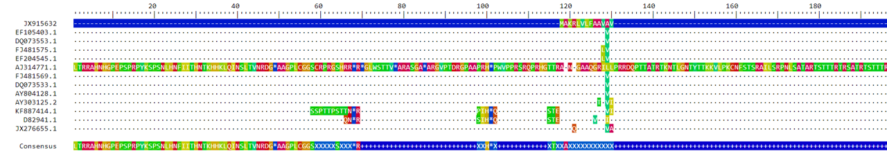
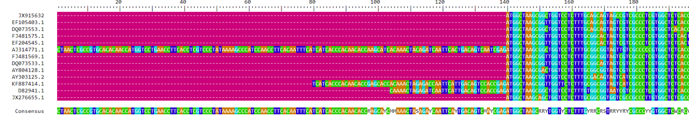
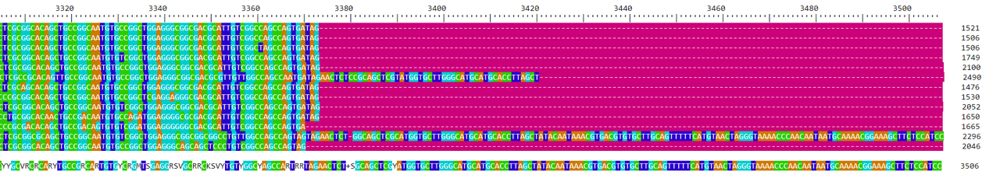

# (PART\*) ALIGNMENT {-}

```{r, include = FALSE}
ottrpal::set_knitr_image_path()
```


# Why do we align sequences?

Sequence alignment is the art of lining up sequences from different samples in such a way that that reflects shared quality. When we perform an alignment in preparation for phylogenetic analyses, we aim to line up our sequences so that the complete alignment reflects the evolutionary relationships among all the samples. When we look at it, this mean that long stretches of the sequences should be fairly similar, with smaller regions of dissimilarity scattered throughout.

As the samples become more distantly related from each other, the regions of similarity will become smaller and the regions of dissimilarity will become larger. How the regions of dissimilarity are arranged can change, depending on our choices of assumptions.

All alignment programs will assign a "price" to each potential alignment the create, then return the least costly alignment as the final result. Most programs create potential alignments using an algorithm that assigns similarity scores to each pairwise comparison. The program then uses these scores to determine the final potential alignment. The algorithm also assigns penalties for alignments that include undesireable features. In general, an alignment algorithm can apply two major costs:

  - gap opening cost: we can apply a penalty for opening (or starting) any gap (indicating an insertion or deletion event)
  - gap extension cost: we can apply a penalty for making a gap longer


Alignments can be created using either the nucleotide sequence or the amino acid sequence. Amino acid sequences can be useful when dealing with more diverse samples where the nucleotide sequence includes lots of regions of dissimilarity and few regions of similarity. Because there are only 4 nucleotides, compared to 20 amino acids, amino acid sequence alignments tend to be less noisy than nucleotide sequence alignments. Amino acid sequences are also slower to change than nucleotide sequences due silent (or synonymous) nucleotide mutations that don't affect the amino acid sequence.
  
Keep in mind that any alignment we use is still just a hypothesis - it may be a well-supported hypothesis that represents our best knowledge, but it may still not be correct. We may never know what the "true" alignment is.


```{r, echo = FALSE, warning=FALSE, message = FALSE}
library(ape)
grass <- read.GenBank(c("JX915632","EF105403.1","DQ073553.1",
      "FJ481575.1","EF204545.1","AJ314771.1","FJ481569.1",
      "DQ073533.1","AY804128.1","AY303125.2","KF887414.1",
      "D82941.1","JX276655.1"), as.character=T)
write.dna( grass, file = 'grass.fasta', format = 'fasta' )

if (!require("BiocManager", quietly = TRUE))
    install.packages("BiocManager")
BiocManager::install('DECIPHER')
```


# Creating a multiple sequence alignment

There are several packages available now for performing alignments in R, include `ape` (which we have used before), `Biostrings`, and `mas`. Each of these have their own strengths, and all of them will produce a good alignment. There are also many non-R-based alignment programs. For this class, we will focus on how to use the `DECIPHER` package, which will allow us to create an alignment, as well as look at it.

## Installing the `DECIPHER` package

`DECIPHER` is available via Bioconductor, which means we can install it using the AnVIL::install command. After we install the package, we can then open it via the `library()` command. (If you are prompted to update dependent packages, choose "all".)

```{r, warning=FALSE, message = FALSE}
#AnVIL::install('DECIPHER') #use this command to install the DECIPHER package

library(DECIPHER)
```

## Loading the fasta file

DECIPHER's commands use a fasta file as their input. We could load the fasta file directly into one of the commands, or we could load the fasta file into an object that we then pass to the commands. The second option gives us more flexibility and ultimately ends up saving time - we can load the file once and use it for multiple calculations. 

We are loading the fasta object we created and saved in our working directory last time. If the fasta file isn't in your working directory, that's okay - you can replace "grass.fasta" with the path to the directory in which it's saved, followed by the file name.

```{r, warning=FALSE, message = FALSE}
fas <- "grass.fasta"
```


## Creating an alignment

DECIPHER lets us create alignments in a couple of ways, since we downloaded sequence from a protein-coding gene (_Glu-1_). We can align the sequences directly, or we can have the program translate the DNA sequences into amino acid sequences, then align the amino acid sequences. If the sequences you want to align are not protein-coding, then you can only align the sequences directly.

This part has a couple of steps. First, pass the fasta file into an object formatted as a DNAStringSet object using the command `readDNAStringSet`. 

```{r, warning=FALSE, message = FALSE}
dna <- readDNAStringSet(fas)
dna
```

(You might have noticed a warning message about an invalid character type. Sometimes this happens when you download data from GenBank, because people may have made a mistake in the nucleotide sequence when they submitted their samples. Since it is only one base (and the sequences themselves are at least 1500 bp long), so excluding it is unlikely to bias our results.)

Although it might look like the sequences are aligned in the DNAStringSet object, they really aren't. To do so requires another command.

First, let's align our sequences using just the nucleotides.

```{r, warning=FALSE, message = FALSE}
DNA.no_trans <- AlignSeqs(dna)
```

We can also align our sequences after they are first translated. The translated amino acids are aligned, and then the sequences is reverse-translated back to nucleotides.

```{r, warning=FALSE, message = FALSE}
DNA.trans <- AlignTranslation(dna)
```

Translating the nucleotide sequences sped up the alignment process, although both were fast enough it isn't a big deal to directly align the nucleotides. Your choice of which alignment procedure to use will largely come down to whether you are using coding sequence and how divergent your samples are. If you aren't using coding sequence, you will need to align using the nucleotides. If you have samples from deeply divergent species (especially if they come from different phyla), you will generally get a better alignment if you let the program translate your nucleotide sequence to amino acids first.

Now that we've created alignments, it would be helpful to visually check them. (This is possible if your sequences aren't too long, but can become really hard once you start dealing with very long stretches of DNA!) The `BrowseSeqs` command opens a browser window with the aligned sequences. Just remember which window belongs to each alignment!

```{r, warning=FALSE, message = FALSE}
BrowseSeqs(DNA.no_trans)
BrowseSeqs(DNA.trans)
```



You can scroll through the browser windows to see the full alignment. DECIPHER automatically color-codes the nucleotides, which makes it easier to pick out when a sequence doesn't match the others. At the very bottom, DECIPHER displays a consensus sequence, which we can also look at to identify which bases have mutations (or gaps).

The first thing that jumps out it how the two alignment methods resulted in alignments of different lengths. The alignment from the `AlignTranslation` method is longer than the alignment from the `AlignSeqs` method. How the gaps are inserted also differ quite a bit.

At this point, the alignment we choose to use is basically a judgment call. You have to decide which alignment seems "better" to you. With the grass sequences, sample AJ314771.1 doesn't quite seem to fit well with the `AlignTranslation` alignment. There are long stretches of the sequence that aren't aligned with anything else. This doesn't seem to be the case for the `AlignSeqs` alignment.

If we chose to go ahead with the `AlignTranslation` alignment, it would make sense to remove sample AJ314771.1 from our fasta file. You may come across a situation where one (or more) sequences don't seem to fit very well with the others. The best option going forward is to remove those sequences, as keeping them will cause issues when it comes time to infer the phylogeny.

In this situation, it would be reasonable to use the alignment generated by the `AlignSeqs` method. We'll want to trim it to remove the ends with very little sequence coverage. We will keep everything between base 140 and 3373. To trim the sequences, we will write a new fasta file, then use it to create a new `DNAbin` object. If you haven't already loaded the `ape` library in your R session, you should do so now using the `library(ape)` command.






```{r, warning=FALSE, message = FALSE}
writeXStringSet(DNA.no_trans, file="grass_aligned.fasta")

grass.align <- read.dna("grass_aligned.fasta", format="fasta", as.matrix=TRUE)
```

The trick for this step is that we specified the `grass.align` object be loaded as a matrix, not as a list. We can subset our sequences using brackets since `grass.align` is in matrix format.

```{r, warning=FALSE, message = FALSE}
grass.trimmed <- grass.align[,140:3373]

grass.trimmed

```

Congratulations! You now have a trimmed alignment, ready for inferring trees. To be on the safe side, we will save it as a fasta file.

```{r, warning=FALSE, message = FALSE}
write.dna( grass.align, file = 'grass_aligned.fasta', format = 'fasta' )
```

::: {.fyi}
**R BASICS**

R has both data types and data structures. Data types (like character (for letters) or numeric (for real or decimal numbers)) can be combined to form data structures. Some of the data structures include:

  * vector
  * list
  * matrix
  * data frame

The data structures differ based on their size and what data types they can accept. A vector is a single dimension collection of one data type. You can have vectors made up of many character data types or many numerical data types, but you can't have a vector of both character and numerical data types together.

`DNAbin` objects are normally formatted as lists, which can be thought of as a multidimensional collection of vectors where each vector can be of a different type. (Within a vector everything is still a single character type.) In the code above, we specified the `DNAbin` object be formatted as a matrix. The matrix data structure is basically vectors in more than one dimensional, which means all the elements within a matrix must be the same data type (in this case, everything was a character).

But why did we need the `DNAbin` object to be a matrix? Simply put, having it as a matrix meant that we could subset it like a matrix. That's what we did with the brackets. 

grass.align[,140:3373]

The comma at the beginning of the bracket told R that we wanted to keep all the rows in the matrix `grass.align`. The 140:3373 told R to keep all the columns between column 140 and column 3372 (as well as those two columns).

If we had chosen to remove one of our samples (let's say, the third sample), we could use the brackets to do so as well. The command for that would look like:

kept.sequences <- grass.align[c(1:2,4:13),]

The `c(1:2,4:13)` is telling R that we want to keep all the sequences between the 1st and 2nd rows, as well as all the sequences between the 4th and 13th row. We have to use the c() syntax because we have two sets of rows to keep.

:::


```{r}
sessionInfo()
```

