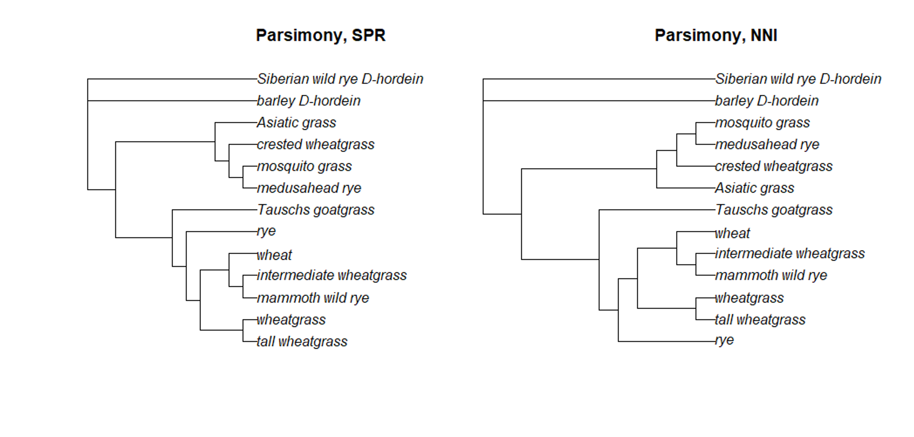
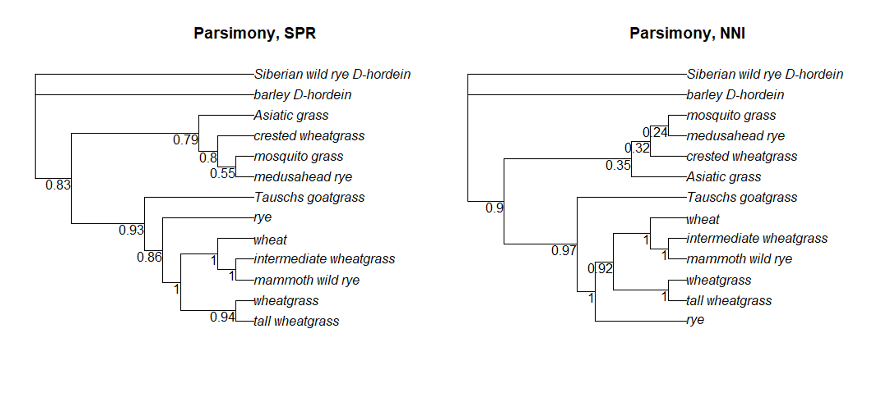

# (PART\*) PARSIMONY {-}

```{r, include = FALSE}
ottrpal::set_knitr_image_path()
```

# The parsimony method of tree estimation

This week we begin examining the tree-searching methods of tree estimation. Specifically, we will focus on the parsimony method.

## Parsimony

Parsimony operates on the assumption that the tree containing the fewest sequence changes is the most accurate estimation of what really occurred. Essentially, parsimony assumes that characteristics shared by taxa are shared as the result of common ancestry. Sometimes this assumption is not valid, but often it is, particularly when there is not too much homoplasy (when two or more sequences or structures resemble each other but don't have a common ancestral origin) or variation in rates between sites. Often there will be multiple equally parsimonious trees, in which case you can either make a consensus tree (a combination of all the equally parsimoniously trees), or pick one tree that is illustrative of the point being discussed. If you choose the second, make sure you mention the existence of the other, equally parsimonious trees!

Parsimony is technically not a phylogenetic method because it does not apply a substitution model to the sequence data. A proper parsimony tree does not scale the branches to the number of changes between taxa. Instead, all the taxa are lined up and the branches are however long they need to be in order for the taxa to line up.


We will be scaling the branches in our parsimony trees to reflect the number of changes along each branch, so we will not be working with the parsimony method in its purest form.

The parsimony method is the backbone of the field known as "cladistics." It's largely fallen out of favor as phylogenetics is much more suited to analyzing genetic data. Parsimony still survives as a method of choice for researchers at the American Museum of Natural History and among paleontologists (or anyone who is inferring trees based on non-genetic data). The battle between cladistics proponents and phylogenetics proponents was so intense during the 1980s and 1990s my undergraduate advisor jokingly referred to it as the Clade Wars.


## Tree searching methods

At the heart of the parsimony approach is the idea of tree searching. The parsimony algorithm starts with a random tree (sometimes even a neighbor joining tree, or a tree the researcher supplies). The starting tree is scored, then the tree topology is rearranged in some way to create a new tree. The new tree is scored; if its score is better than the previous tree, the new tree is kept. The process then continues until an optimum tree score is found or it reaches a set end point.

When a tree has only a small number of taxa, an exhaustive search of all possible topologies is possible. However, the number of possible topologies grows exponentially as the number of taxa increases (in his _Phylogenetic Trees Made Easy_ manual, Barry G. Hall estimates that for a tree with just 10 taxa, there are more than 34 million possible rooted topologies). It rapidly becomes impractical to perform an exhaustive topology search to find the best tree. Instead, researchers have developed tree-searching algorithms to more quickly sort through all the possibilities.

### Branch and bound

The branch and bound method, while not exhaustive, can still be time-consuming when dealing with more than ~10 taxa. In this approach, an initial random tree of all the taxa is created and scored.Then, the algorithm starts with a tree containing three taxa. Next, a branch containing a fourth taxon is inserted in all possible locations and each possible tree is scored.  If none of the possible trees scores better than the initial random tree, this particular search is abandoned and a new starting tree of 3 taxa is created. If, however, any of these possible trees has a score smaller than the score of the initial random tree, the search continues and a fifth taxon is added. The process is repeated, with one change - if none of the trees with five taxa score low enough, then the search goes back to the four taxa tree and tries a different fifth taxon. This way, the initial work isn't wasted.

### Nearest Neighbor Interchange (NNI)

Nearest neighbor interchange algorithms take advantage of the fact that there are only three possible ways to connect four groups. A random starting tree is divided into four parts (or subtrees). These four subtrees are connected in all three possible ways. The most parsimonious arrangement is kept, and the new tree is then randomly subdivided into four new subtrees so the process can start again.

### Subtree Pruning and Regrafting (SPR)

Subtree pruning and regrafting has two major steps. First, a random subtree is removed from the original starting tree; then, the subtree is inserted elsewhere on the main tree to create a new node. This rearranged tree is scored. If if is more parsimonious than the starting tree, the new tree is kept, and another subtree is pruned and regrafted.

### Star decomposition

We actually saw the star decomposition method in the neighbor joining section. All taxa are connected together at a single node to form a star tree. Next, a pair of taxa are joined to form a new node and the tree is scored. This is repeated until all possible pairs have been evaluated. The best is kept and then another pair of taxa are joined, and the process continues.

# Building a parsimony tree

```{r, echo = FALSE, warning=FALSE, message = FALSE}
library(ape)
grass <- read.GenBank(c("JX915632","EF105403.1","DQ073553.1",
                        "FJ481575.1","EF204545.1","AJ314771.1","FJ481569.1",
                        "DQ073533.1","AY804128.1","AY303125.2","KF887414.1",
                        "D82941.1","JX276655.1"), as.character=T)
write.dna( grass, file = 'grass.fasta', format = 'fasta' )
library(DECIPHER)
fas <- "grass.fasta"
dna <- readDNAStringSet(fas)
DNA.no_trans <- AlignSeqs(dna)

writeXStringSet(DNA.no_trans, file="grass_aligned.fasta")

grass.align <- read.dna("grass_aligned.fasta", format="fasta", as.matrix=TRUE)
grass.trimmed <- grass.align[,140:3373]
write.dna( grass.align, file = 'grass_aligned.fasta', format = 'fasta' )
```


We will continue using the `phangorn` package for our parsimony analyses. We are also going to briefly use the `phytools` package to modify the fasta file. The manual for the `phytools` package is [here](https://cran.r-project.org/web/packages/phytools/phytools.pdf).


```{r,  warning=FALSE, message = FALSE}
install.packages('phylotools')

library(phylotools)
library(phangorn)
```

## Editing the fasta file

Last week we edited the tip labels of our neighbor joining tree so that the tree displayed the common names of our grass samples instead of the GenBank accession numbers. However, we're going to be building multiple trees from the grass fasta file, so it makes sense to edit the fasta file directly so we don't have to manually change the tip labels every time. `Phytools` allows us to edit fasta files using the `rename.fasta` command. Before we can use it, though, we need to create a dataframe with two columns: the first column contains the old sample names (the GenBank accession numbers), while the second column contains the new sample names (the common names for each sample).

A dataframe in R is a table or a two-dimensional array-like structure in which each column contains values of one variable and each row contains one set of values from each column. We can create one by binding (or pasting) two vectors together. The vectors we are binding MUST have the information in the same order (that is, the order of GenBank accession numbers must be the same order as the common names).


```{r,  warning=FALSE, message = FALSE}
old.labels <- c("JX915632", "EF105403.1", "DQ073553.1",
                "FJ481575.1", "EF204545.1","AJ314771.1",
                "FJ481569.1", "DQ073533.1", "AY804128.1",
                "AY303125.2", "KF887414.1", "D82941.1",
                "JX276655.1")


new.labels <- c('wheat', 'intermediate wheatgrass',
                'mammoth wild rye', 'wheatgrass', 
                'tall wheatgrass', 'rye', 'Asiatic grass', 
                'crested wheatgrass', 'Tauschs goatgrass', 
                'medusahead rye', 'mosquito grass',
                'barley_D-hordein', 'Siberian wild rye_D-hordein' )

sample.df <- cbind(old.labels, new.labels)
sample.df

```

In the dataframe `sample.df`, you can see that each row is a sample, with the accession number in column 1 and the common name in column 2.

We can now use the `rename.fasta` command. This command requires three arguments. The first is the fasta file that is being edited, the second is the dataframe that contains both the old and new names, and the third is the name for the newly edited fasta file. The new fasta file will be saved in your working directory (on AnVIL, this is the persistent disk).

```{r,  warning=FALSE, message = FALSE}
rename.fasta('grass_aligned.fasta', sample.df, 'grass_aligned-renamed.fasta')
```

## Inferring a parsimony tree

There are several options for inferring parsimony trees using `phangorn`. We can use the branch and bound tree rearrangement method with the `bab` command, or we can apply the nearest neighbor interchange (NNI) or subtree prunning and regrafting (SPR) approaches with either the `optim.parsimony` or `pratchet` (parsimony ratchet) commands. The branch and bound method can be very, very slow if you have more ~10 samples. Let's take a look at the parsimony tree that results from a branch-and-bound search of the grass fasta file.

```{r,  warning=FALSE, message = FALSE}
g.align <- read.phyDat("grass_aligned-renamed.fasta", format='fasta')
bab.tree <- bab(g.align)

bab.root <- root(bab.tree, 
                 outgroup = c('barley_D-hordein','Siberian wild rye_D-hordein'))
plot(bab.tree, main = 'Parsimony, BAB')
```

To test both NNI and SPR approaches for parsimony trees, we will use the `pratchet` command. This particular command has lots of possible parameters we can change.

  - maxit: maximum number of iterations
  
  - minit: minimum number of iterations
  
  - _k_: number of rounds of no improvement after which the ratchet is stopped
  
  - rearrangements: SPR or NNI rearrangements
  
  - trace: how much information to print after each iteration
  
  - all: whether to return all equally parsimonius trees, or just one

The parsimony ratchet is an approach that was developed by KC Nixon in 1999. This approach is a more efficient way to find better trees than by just NNI or SPR rearrangements alone. `phangorn` implements it this way:

1. Create a bootstrapped dataset from the original dataset (more on bootstrapping later).

2. Take the current best tree (or starting tree, for the first go-round) and perform tree rearrangements using the bootstrapped dataset, saving the best bootstrap tree.

3. Use the best bootstrap tree and perform tree rearrangements using the original dataset. Compare the parsimony score (the smallest number of changes necessary to describe the data for a given tree) of the bootstrapped tree and the original best tree. Whichever tree is best (ie, has the lowest parsimony score) is then saved as the new "best" tree.

This process is repeated until either the algorithm reaches the max number of iterations or the _k_ number is reached.

```{r,  warning=FALSE, message = FALSE, eval=F}
tree.SPR <- pratchet(g.align, maxit = 10000, minit = 100, k = 10,
                           all = T, rearrangements = 'SPR', trace = 0)

tree.NNI <- pratchet(g.align, maxit = 10000, minit = 100, k = 10,
                           all = T, rearrangements = 'NNI', trace = 0)

#We assign branch lengths to the tree equal to the number of changes

tree.SPR <- acctran(tree.SPR, g.align)
tree.NNI <- acctran(tree.NNI, g.align)

SPR.root <- root(tree.SPR, 
                      outgroup = c('barley_D-hordein','Siberian wild rye_D-hordein'))
NNI.root <- root(tree.NNI, 
                      outgroup = c('barley_D-hordein','Siberian wild rye_D-hordein'))

plot(SPR.root, main = 'Parsimony, SPR')
```

```{r,  warning=FALSE, message = FALSE, eval=F}
plot(NNI.root, main = 'Parsimony, NNI')
```

Take a look at the topology of the trees created using the branch-and-bound (BAB), SPR, and NNI approaches. Do you see any differences?





## Parsimony scores

We can compare parsimony trees directly by comparing their parsimony scores. As mentioned above, the parsimony score is just the minimum number of changes necessary to map a dataset onto a particular tree topology. A smaller number is better.

```{r,  warning=FALSE, message = FALSE}
#for each parsimony command, we need to provide a tree and a phyDat object
parsimony(bab.root, g.align)

parsimony(SPR.root, g.align)

parsimony(NNI.root, g.align)
```

In the case of our grass dataset, all the parsimony scores are the same, so all of the methods performed equally well. We got lucky - this is not always true!

## Bootstrapping

It would be nice to have a way to measure the robustness of each individual branch and clade, not just the overall tree. In phylogenetics, the measurement of choice for determining the "strength" of a branch is the bootstrap value. 

Bootstrapping is a resampling method that attempts to use the original data as a way to judge the strength of phylogenetic inference. For each bootstrap replicate, the program will randomly select a number of sites to create a pseudoalignment. (For example, if the original alignment has 100 bases, the bootstrap algorithm will randomly choose 100 bases to create a new alignment. Some bases might be chosen multiple times, while other bases don't get sampled.) After generating the pseudoalignment, a new tree is built and the relationships are stored. Here is a nice illustration of the process by [www.analyticsvidhya.com](https://www.analyticsvidhya.com/blog/2020/02/what-is-bootstrap-sampling-in-statistics-and-machine-learning/)


After all the bootstrapping replicates have been analyzed, each branch of the actual tree will be labeled with a value that reflects how frequently that branch was seen among the replicate trees. Higher values mean the branch has more support. In general, researchers consider a branch with a bootstrap value > 0.5 as well-supported.

Luckily, the `pratchet` command automatically does bootstrapping, so we already have the bootstrap information saved. We can see the bootstrap values on the trees using the `plotBS` command.

```{r,  warning=FALSE, message = FALSE, eval=F}
plotBS(SPR.root, type = "p", main = 'Parsimony, SPR')
```

```{r,  warning=FALSE, message = FALSE, eval=FALSE}
plotBS(NNI.root, type = "p", main = 'Parsimony, NNI')
```





You may need to resize the Plots window in order to more easily read the bootstrap values for each branch.


::: {.fyi}
can we bootstrap our neighbor joining tree?

In short, yes, although we have to do a bit of R trickery, because neither `ape` nor `phangorn` have the option to bootstrap neighbor joining trees built in. We can get around this by writing our own function.

Basically, we will write a function that creates a distance matrix using the `dist.ml` command. (This command is a more general form of the `dist.dna` command. As of this writing, using `dist.dna` in the function throws an error.) Then we can include both a phyDat object and our function in the `bootstrap.phyDat` command. R will take the phyDat object and pass it to our function, then use the distance matrix in a bootstrap analysis.

```{r, warning=FALSE, message = FALSE}
fun <- function(x) nj(dist.ml(x))

bs_nj <- bootstrap.phyDat(g.align,  fun)

dna_dist <- dist.ml(g.align, model = 'JC')
nj.tre <- nj(dna_dist)
nj.root <- root(nj.tre, 
                outgroup = c('barley_D-hordein','Siberian wild rye_D-hordein'))

plotBS(nj.root, bs_nj, 'p', main = 'Neighbor Joining')
```

This isn't a perfect approach - for one thing, we can't use the K80 substitution model for the `dist.ml` command. Instead, we simply used the JC model. Also, the bootstrapping values in this approach are from 1 to 100, not 0 to 1 as calculated by the `pratchet` command.

How does the bootstrap support for the neighbor joining tree compare to the bootstrap support for the parsimony trees?

::: 


## Saving files

Make sure to save at least one of the trees you built using the `pratchet` command to the persistent disk.

```{r, warning=FALSE, message = FALSE, eval=FALSE}
write.tree(SPR.root, file = 'spr_grass.tre')
write.tree(NNI.root, file = 'nni_grass.tre')
```


```{r}
sessionInfo()
```

