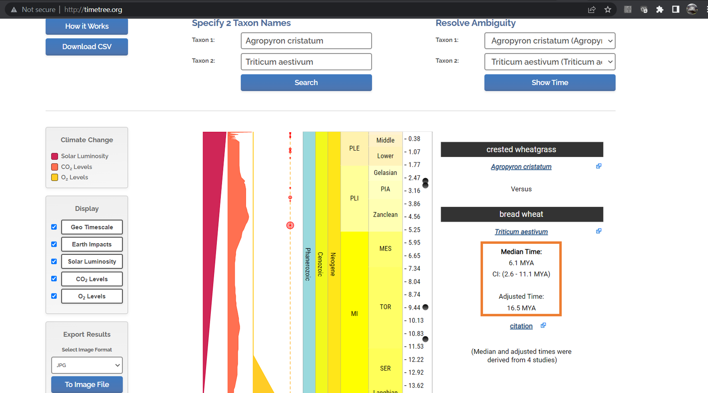
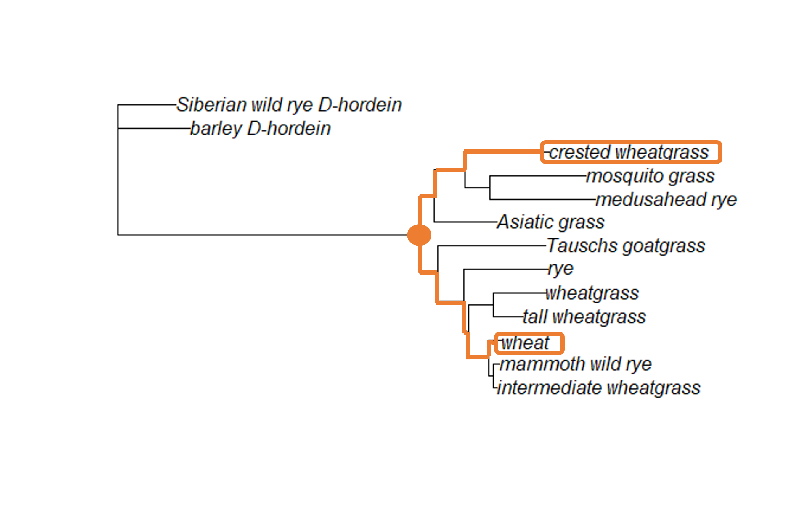
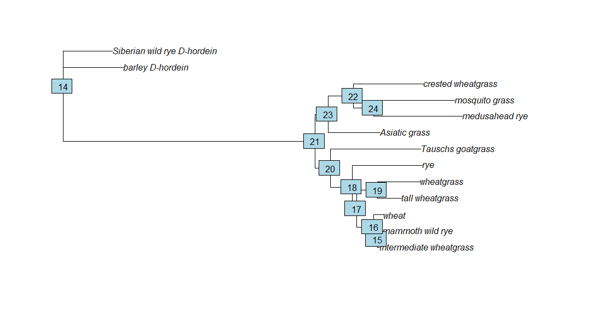
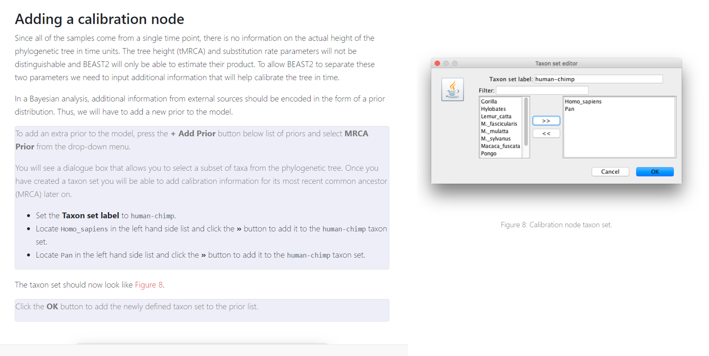
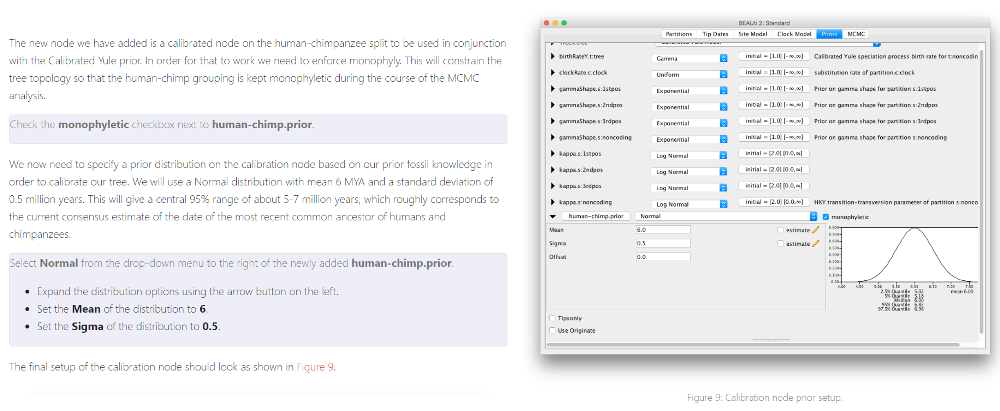
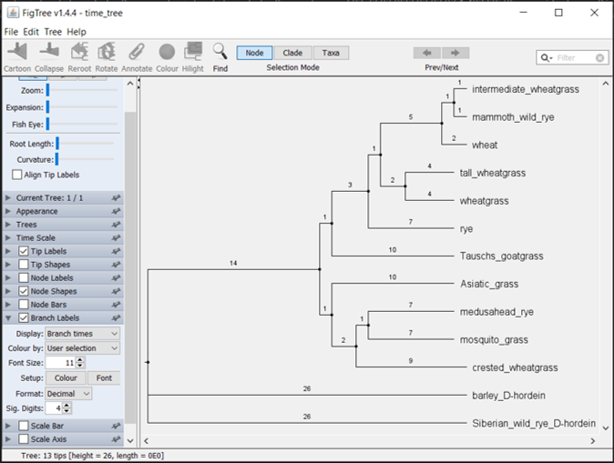

# (PART\*) TIME TREES {-}

```{r, include = FALSE}
ottrpal::set_knitr_image_path()
```
# What is a time tree?

We're tackling the topic of time trees, which are basically phylogenetic trees where the branches have been scaled to show time since divergence. Short branches mean very little time has passed since the most recent common ancestor, while longer branches mean a long time has passed. Without realizing it, you have probably looked at trees you've built earlier in the class and assumed the branches indicate time as well as the number of mutations or changes seen in your alignment. This is really only true when the branches have been scaled.

Absolute time trees, which are trees whose branches have been scaled based on a known calibration point, have been considered controversial in the past, though they've gained acceptance in the past ten years. Relative time trees (trees that have been scaled relative to the root of the tree, although the age of the root is unknown) were accepted fairly quickly, particularly when dealing with closely-related species. 

## Molecular clocks

What makes time trees possible are the use of a molecular clock. This is the idea that DNA mutations happen in a fairly regular fashion that we can describe and simulate using mathematical models. The simplest version of a clock is to take the number of differences between two species and divide them by the time since they diverged. The resulting number is mu, or the mutation rate. In 1963, Emanuel Margoliash introduced the genetic equidistance idea, writing: "It appears that the number of residue differences between cytochrome c of any two species is mostly conditioned by the time elapsed since the lines of evolution leading to these two species originally diverged. If this is correct, the cytochrome c of all mammals should be equally different from the cytochrome c of all birds. Since fish diverges from the main stem of vertebrate evolution earlier than either birds or mammals, the cytochrome c of both mammals and birds should be equally different from the cytochrome c of fish. Similarly, all vertebrate cytochrome c should be equally different from the yeast protein."

Not all trees show clocklike patterns. In some cases, the number of mutations is much greater on a branch due to selection pressure. In other cases, very long branches will appear to stop developing new mutations due to saturation (sites are changing more than once, but we can only detect one change). Recent work has developed new clock models to get around these issues.

A molecular clock can only say how long tree branches are relative to each other, but cannot estimate actual ages of nodes or times to most recent common ancestors (MRCA). In order to do that, you need to apply calibration points.

## Calibration points 

Calibration points are phylogenetic splits which researchers have managed to date with some accuracy. There are three major sources for calibration dates: the fossil record, geologic events, and independent molecular data. The fossil record can be used to estimate the latest point at which a split might have occurred and is considered the gold standard of calibration methods. However, not everything can be captured by the fossil record, so we rely on other methods to fill in the missing spaces. Geologic events are quite useful when working with species that are endemic (or exclusively found) to a location like volcanic islands. A geologic split estimate is the earliest possible date for a split to have occurred. One of the most famous geologic event used for dating is the formation of the Hawaiian islands. We have fairly firm dates for when each of the islands arose, so we can date with some certainty the date when species arrived on each island.

Independent molecular data calibration is the only source of calibration for many taxa, but dates estimated using this approach also have the greatest uncertainty, as they are indirectly based on either fossil record or geologic event dating of related taxa.

# Adding calibration points to your phylogenies

This week we will be working with both RStudio and BEAST. Within RStudio, we will be using the `ape` package again.

## Choosing calibration points

This week, you should choose at least one calibration point to add to your tree. You can pick any two taxa from a tree and figure out the estimated age of the divergence between them (or the estimated age of the most recent common ancestor between them). The website [TimeTree](http://timetree.org/) has divergence estimates for many different taxa pairs.

When two taxa (usually species, but it could be taxa from higher taxonomic levels) are entered into TimeTree, the website first checks whether these taxa are in the TimeTree of Life database. If they are, the divergence estimate between the two (the age of the MRCA between them) is retrieved. If one or both of the taxa are _not_ in the database, the website scans NCBI taxonomy to find the closest relative of the species and uses that as a proxy to find the MRCA for two taxa.

If your taxa are not on TimeTree, you will have to be creative in finding a calibration point. You might be able to find information in the literature. If you are working with viral samples, you can use the date the sample was collected as a tip calibration point. If nothing works and you are stuck, email me and I will send you the grass dataset to work with.

For the grass dataset, let's use the divergence between bread wheat (_Triticum aestivum_) and crested wheatgrass (_Agropyron cristatum_). When we search TimeTree, we see several estimated divergence times.





TimeTree gives us two divergence estimates: a median estimate (with 95% confidence interval), and an adjusted time, which is quite a bit older than the median estimate. This is what TimeTree says about their adjusted time estimate: "Answer: Due to conflicting time estimates between studies, ancestral nodes can be assigned younger ages than their descendants. A smoothing technique is used to adjust these times so the resulting tree is ultrametric." (An ultrametric tree is one where all the a rooted tree with edge lengths where all leaves are equidistant from the root. When trees have been scaled using calibration points, they often become ultrametric.)

In this case, the very youngest divergence estimate from TimeTree is 2.6 million years ago (MYA), while the oldest is 16.5 MYA. We will use these estimates going forward. We could have easily chosen the other estimates as well. There isn't necessarily a right or wrong choice here. You just need to be upfront about the estimates you chose.

## Adding calibration points to internal nodes for ML trees

When we look at the grass tree, we see the node that indicates the MRCA between crested wheatgrass and bread wheat (labeled wheat on the tree) is pretty deep within the tree.





If we trace the branches until we find the node where they connect, we can see it is the basal node of the tree (the node which connects the ingroup to the outgroup). In order to add a calibration date to our ML tree in R, we need to know how R has identified (or labeled) that particular node. You can either load your saved ML tree or create it again. 

```{r, warning=FALSE, message = FALSE}
library(ape)
library(phangorn)

grass.align <- read.phyDat("grass_aligned-renamed.fasta", format = "fasta")
dist <- dist.ml(grass.align)
nj.tree <- nj(dist)

fit <- pml(nj.tree, data = grass.align)
fitGTR.G <- update(fit, model = "GTR", k = 4)
fitGTR.G <- optim.pml(fitGTR.G, model = "GTR", optGamma = T, rearrangement = "stochastic", control = pml.control(trace = 0))

tree.root <- root(fitGTR.G$tree, outgroup = c('barley_D-hordein','Siberian wild rye_D-hordein'))
```

```{r, warning=FALSE, message = FALSE, eval=F}
plot(tree.root)
nodelabels()
```





The node that connects crested wheatgrass and wheat (and indicates the MRCA between the two) is node 21. We will use that information, as well as the estimated divergence times from TimeTree, to apply a timescale to the ML tree using the `chronos` command from the `ape` package. If you'd like to read more about it, the `ape` manual is [here](https://cran.r-project.org/web/packages/ape/ape.pdf).

The `chronos` command takes several arguments. The first is a lambda starting estimate (the smoothing parameter). The next argument is the model of rate substitution variation (how much should the mutation rate vary among the branches of the tree?). `chronos` can implement a strict clock (no variation, called "clock"), a correlated clock (where the variation is correlated between branches, but does exist, called "correlated"), a discrete clock (where estimates are discrete for each branch and requires multiple estimated parameters, called "discrete"), or a relaxed clock. The relaxed clock (called "relaxed") allows for discrete mutation rates on the branches, but doesn't involve estimating a different parameter for each branch. We'll implement the discrete clock in this example. (The estimation is fairly quick, so you can easily implement all four and see how the resulting trees differ.)

The remaining arguments is the calibration data frame (which includes the actual calibration points). We use the command `makeChronosCalib` command to create the calibration data frame. This command takes the ML tree as the first argument.

```{r, warning=FALSE, message = FALSE}
calib <- makeChronosCalib(tree.root, node = 21, age.min = 2.6, age.max = 16.5)

calib
```


If we want to add more calibration points, we can use the `c` (concatenate) command. This tells R that a string of multiple entries are being entered at once.

```{r, warning=FALSE, message = FALSE}
calib2 <- makeChronosCalib(tree.root, node = c("21", "19"), age.min = c(2.6,3.0), age.max = c(16.5, 16.5))

calib2
```

Creating the time tree, we simply combine the `chronos` and `makeChronosCalib` commands.

```{r, warning=FALSE, message = FALSE}
time.tree <- as.phylo(tree.root)

time.tree_dated <- chronos(time.tree, lambda = 1, model = "discrete", quiet = FALSE, calibration = calib, control = chronos.control())
```

Before we plot the tree, we need to do a bit of formatting of the branch lengths (called edge.length). R will be default save these values to 10 decimal places, which can make visualization a little tricky. We're going to format them so they only have two decimal places, then plot them on top of the time tree.

```{r, warning=FALSE, message = FALSE}
time.tree_dated$edge.length <- round(time.tree_dated$edge.length, digits = 2)

plot(time.tree_dated)
edgelabels(time.tree_dated$edge.length, bg="black", col="white", font=2)
```

Behold, you have a time tree. The branch lengths are now scaled to million of years, so you can estimate the age of MRCA between any two taxa on the tree. For example, based on the discrete clock model, our tree suggests the MRCA between mosquito grass and medusahead rye lived ~11 MYA (the length of the branch between mosquito grass and the node that denotes the common ancestor with medusahead rye).

Before you end your session, make sure you save your tree (and then download the .tre file to your desktop).

```{r, warning=FALSE, message = FALSE}
write.tree(time.tree_dated, "ml_grass_timetree.tre")
```

## Adding calibration points for Bayesian trees

We can add calibration points using the BEAUTi gui you worked with last week. In this case, we open BEAUTi and load our dataset. We have two choices at this point: we can choose the "Tip Dates" tab and specify the date each sample was taken (useful for viral trees, especially during an outbreak), or we can choose the "Clock Model" tab (if you do this, use a strict clock model unless you are certain your data are not clock-like). 

If you've chosen to not use Tip Dates, we will add additional calibration points in the "Priors" tab. These instructions are taken from the tutorial you worked with last week.








The rest of your parameters (including your substitution model and priors) can be set to the same values you used last week. Follow the instructions from last week to get your final Bayesian tree.

## Visualizing the time trees in FigTree

After you finish creating your trees, you can visualize both the ML and Bayesian tree using FigTree. Play around with the options to make the tree look nice - I recommend making the tip labels larger. Be sure to include your branch lengths! Those are now scaled to be the divergence times for both the ML and Bayesian trees.





```{r}
sessionInfo()
```

