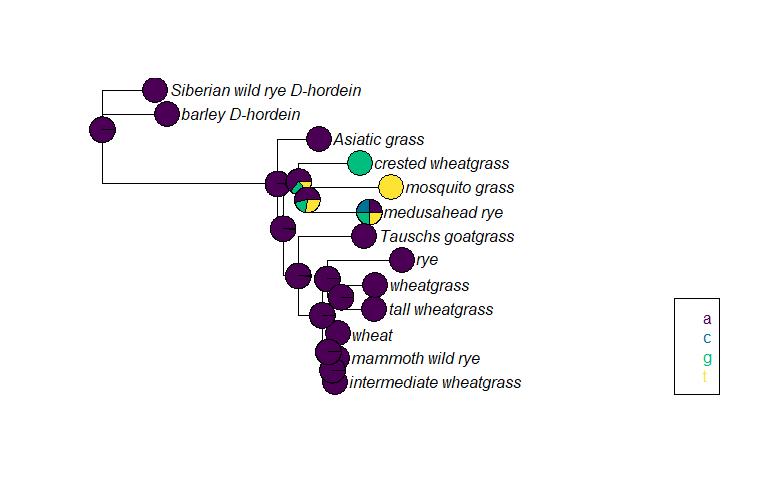
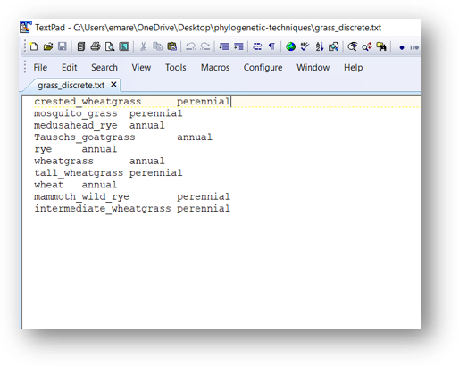
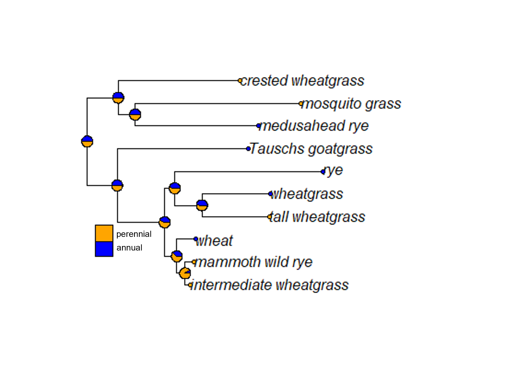

# (PART\*) ANCESTRAL STATE RECONSTRUCTION {-}

```{r, include = FALSE}
ottrpal::set_knitr_image_path()
```
# Ancestral state reconstruction

For some studies, building a phylogenetic tree is just the beginning. The researchers are more interested in using their phylogenetic tree to test other hypotheses about evolution. One of the most common of these is ancestral state reconstruction, or identifying the state of a trait in a common ancestor of a clade. Researchers might be interested in the ancestral nucleotide at a particular part of as sequence (especially a coding sequence), or they might be curious about the ancestral phenotype or behavior.

Ancestral state reconstruction analyses can be done using tools in the `phangorn` and `phytools` libraries in R.

## Reconstructing ancestral sequences

Let's start by reconstructing putative ancestral sequences at the nodes within our grass tree. We will use both the `phangorn` and `phylotools` packages. We need both the fasta file and an ML tree. I've chosen to recreate the ML tree instead of loading my saved tree directly becausee R has reformatted the taxa names slightly in the grass tree. If this has not happened to you, you can load your ML tree directly using the `read.tree` command instead of rerunning the analysis.

```{r, warning=FALSE, message = FALSE}
#install.packages('phytools')
library(phangorn)
library(phylotools)

grass.align <- read.phyDat("grass_aligned-renamed.fasta", format = "fasta")

dist <- dist.ml(grass.align)
nj.tree <- nj(dist)

fit <- pml(nj.tree, data = grass.align)
fitGTR.G <- update(fit, model = "GTR", k = 4)

fitGTR.G <- optim.pml(fitGTR.G, model = "GTR", optGamma = T, rearrangement = "stochastic", control = pml.control(trace = 0))

fitGTR.G$tree <- root(fit$tree, outgroup = c('barley_D-hordein','Siberian wild rye_D-hordein'))
plot(fitGTR.G)
```

After we look at the grass tree to make sure it is rooted the way we want, we use the `ancestral.pml` command to estimate the ancestral sequence for each node. `ancestral.pml` can run either an ML or Bayesian analysis. This command takes two arguments: the full output of your ML analysis and a choice of either "ml" or "bayes". We will use ML, but you could just as easily use the Bayesian method. 

After running the ancestral state reconstruction, we plot the nucleotide at base 209 for each node and tip. (I randomly chose base 209. In practice, researchers likely would have already identified locations of interest.)

```{r,eval=FALSE, warning=FALSE, message = FALSE}
anc.ml <- ancestral.pml(fitGTR.G, "ml")

plotAnc(fitGTR.G$tree, anc.ml, 209)
```


At base 209, most of the samples and putative most recent common ancestors have a G, although at some point a mutation occurred in the ancestors of the rye/wheatgrass/tall wheatgrass/wheat/mammoth wild rye/intermediate wheatgrass clade, which is why those taxa mostly have an A at base 209. (Rye is clearly the weirdo with a T.) The pie chart for the barley D-hordein sequence shows all four possible bases, which just means this particular base is likely missing in the barley D-hordein sequence (either because it was not sequenced or because there was a deletion event and the base does not exist).

Additionally, the pie charts for some ancestral nodes have multiple colors. When estimating ancestral sequences, `ancestral.pml` is calculating the likelihood of each possible nucleotide. At the nodes with pies containing both green and purple wedges, either an A or a G is possible in the ancestral sequence. The bigger wedge indicates the nucleotide with the greatest likelihood.

We could do this for any base, like base 1023 (another one I picked at random).

```{r,eval=FALSE, warning=FALSE, message = FALSE}
plotAnc(fitGTR.G$tree, anc.ml, 1023)
```





We see a very different pattern of inheritance for base 1023. The vast majority of the samples have an A, so nearly all the reconstructed ancestral sequences also have an A. The exception are the nodes in the crested wheatgrass/mosquito grass/medusahead rye clade. All three of the samples have a different nucleotide (or are missing that base), so the reconstructed sequence for the most recent common ancestors is less certain than in the rest of the tree.

## Reconstructing ancestral continuous phenotypes

We can use the `phytools` package to estimate and visualize the reconstruction of continuous traits. I've collected the maximum plant height for most of grass taxa used in the tree, so we can estimate how tall the common ancestors of each clade might have been. 

First, we install and load the `phytools` package, then we load our ML tree.

```{r, warning=FALSE, message = FALSE}
#install.packages('phytools')
library(phytools)

g.tree <- read.tree('grass_ml.tre')
tree.root <- root(g.tree, outgroup = c('barley_D-hordein','Siberian_wild_rye_D-hordein'))

plot(tree.root)
```

This tree has 13 samples, but we aren't going to use all of them for the grass analysis. First, we want to remove the outgroups (the two D-hordein samples) because in this case their position doesn't represent the phylogenetic relationships between barley and the ingroup or Siberian wild rye and the ingroup. (They represent the phylogenetic relationship of D-hordein and the _Glu_ sequences instead. If you used the same genetic region/gene for your outgroup, you can leave them in. If I had used Siberian wild rye _Glu_ sequence, it would be fine to leave the outgroup.) I also was unable to find information on the maximum height of Asiatic grass. We can remove these taxa from the tree directly using the `drop.tip` command.

```{r, warning=FALSE, message = FALSE}
new <- drop.tip(tree.root, c('barley_D-hordein', 'Siberian_wild_rye_D-hordein', 'Asiatic_grass'), trim.internal = TRUE, subtree = FALSE, root.edge = 0, rooted = is.rooted(tree.root), collapse.singles = TRUE, interactive = FALSE)

plot(new)
nodelabels()
```

Great! We have a tree with only the taxa we want, and we can also see the label R has assigned to each node. Now we will create a vector containing all the maximum heights (in inches) for each taxa, in the same order as the tree. We can find the proper taxa order by querying the `tip.label`. 

```{r, warning=FALSE, message = FALSE}
new$tip.label

height <- as.numeric(c(24, 36, 20, 30, 48, 18, 78, 60, 48, 48))
```

Now that we have both our tree and our continuous phenotype, we calculate the ancestral phenotype estimates with the `fastAnc` command. This is an ML method. I have not found a Bayesian approach for ancestral state reconstruction of continuous traits. The arguments for this command are the tree, the vector of the phenotypes, and either "TRUE" or "FALSE" value for calculating the confidence intervals around the likelihood estimate for each node.

```{r, warning=FALSE, message = FALSE}
anc.height <- fastAnc(new, height, CI = TRUE)
anc.height
```


Although there's some variation in the maximum height of the various grass samples in this tree, most of the putative common ancestors are estimated to have been between 35 and 40 inches tall. However, when we look at the CIs for these estimates, we find they are quite wide, suggesting a lot of uncertainty about these ancestral height estimates. Perhaps this isn't the best method for reconstructing this particular trait!

The author of `phytools` has also created a command that allows you to visualize the continuous trait estimates on the tree. Unfortunately, it appears this command doesn't always work for every tree, possibly due to package updates. If you're interested, you can learn more about the [contMap](https://www.rdocumentation.org/packages/phytools/versions/1.0-3/topics/contMap) function.

##  Reconstructing ancestral discrete phenotypes

We might also be interested in reconstructing ancestral phenotypes for discrete traits. We can also do this in `phytools`. For this section, I've collected information as to whether each grass species in the tree is an annual or a perennial plant. 

Before we can do the analysis, we need to convert the edited tree from the earlier section to a `phylo` object, as well as load the phenotypes. The phenotypes can be typed in directly and assigned to a vector as in the previous section, or we can load them from a text file. Here, we load the phenotypes from a textfile that has two columns. The first column is the sample name and the second column is the annual/perennial assignment. This file is tab-delimited.





When we load the file into R, we use the `row.names` command to specify that the first column (the sample names) are set as the row names of our object. We then reformat the first column as a matrix and assign it to the object `pheno`, which turns `pheno` into a vector. (Make sure your phenotype file is in the same order as your tip labels!)

```{r, warning=FALSE, message = FALSE}
new <- as.phylo(new)

pheno <- read.table('grass_discrete.txt', row.names = 1)
pheno <- as.matrix(pheno)[,1]
pheno
```


Now we are ready to do the ancestral state reconstruction using the `ace` command. (`ace` stands for "ancestral character estimation.") This command takes four arguments: the phenotype vector, the tree (formatted as a `phylo` object), the model (which is always set to "ER" for discrete characters), and the character type.

This particular estimation uses a Bayesian approach. The `ace` command technically can do ML estimation according to the manual, but I have not gotten it to work successfully. 

```{r,echo=FALSE, warning=FALSE, message = FALSE}
fit.discrete<-ace(pheno, new, model="ER",type="discrete")
fit.discrete
```

```{r, warning=FALSE, message = FALSE}
fit.discrete<-ace(pheno, new, model="ER",type="discrete")
fit.discrete
```


The output for this estimation gives us scaled likelihoods for the ancestral state at the most basal node. We have to specifically request the scaled likelihood estimates for all the nodes. 

```{r,eval=FALSE, warning=FALSE, message = FALSE}
fit.discrete$lik.anc
```


Well, it appears that whether the common ancestors at each node were annuals or perennials is a toss-up. Maybe we can get more insight if we look at the output on a tree.

Visualizing this output requires a couple of steps. First, we plot the phylogenetic tree. Then, we define the colors that will correspond to each character state. (The commands are flexible so that you can copy and paste for discrete traits with more than two possible states. I've included an alternate way to set the colors, marked with a #.) Finally, we add piecharts at each node and each tip label, then plot the legend.

```{r,eval=FALSE, warning=FALSE, message = FALSE}
plot(new)

cols <- c('blue', 'orange')

nodelabels(node=1:new$Nnode+Ntip(new),pie=fit.discrete$lik.anc,piecol=cols,cex=0.7)

tiplabels(pie=to.matrix(pheno,sort(unique(pheno))),piecol=cols,cex=0.3)

add.simmap.legend(colors=cols,prompt=FALSE,x=0.9*par()$usr[1], y=-max(nodeHeights(new)),fsize=0.8)
```





Similarly to what we saw above when we looked at ancestral reconstruction of sequences, each pie chart indicates the posterior probability of each possible character state. In this case, it appears we can't really tell whether the perennial or annual trait is ancestral. What's clear is that the derived trait (the one that isn't ancestral) has popped up multiple times in multiple clades.

```{r}
sessionInfo()
```

