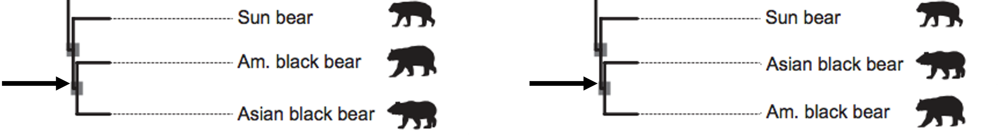
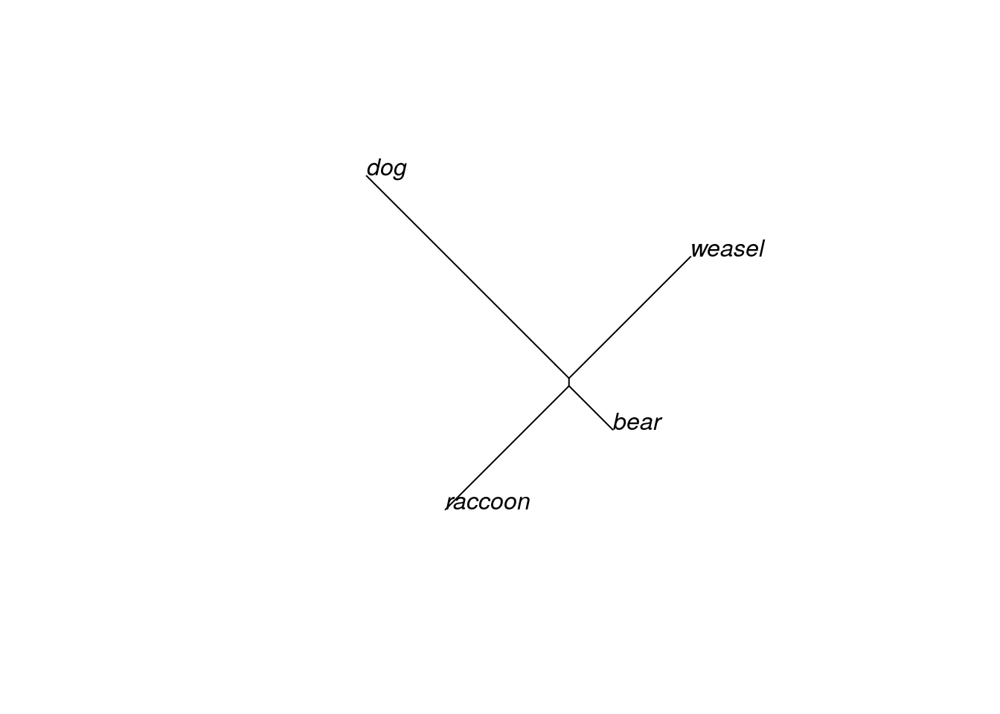
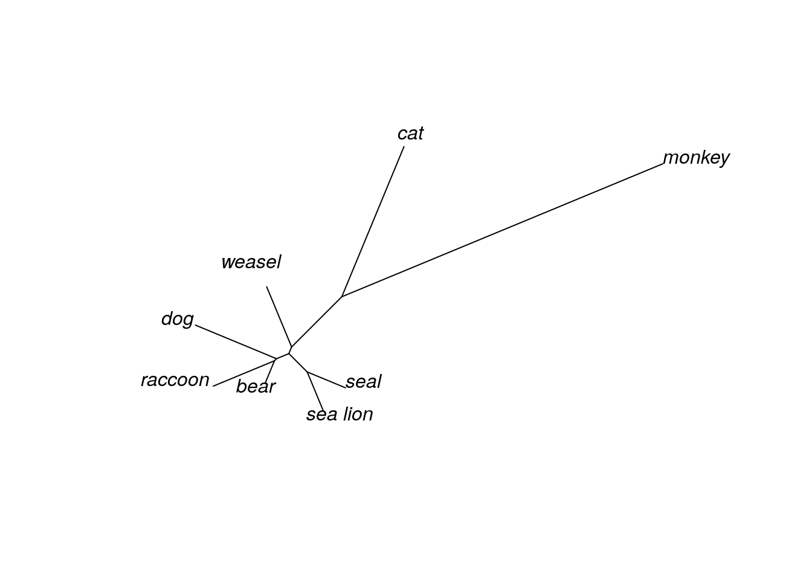

# (PART\*) TREE THINKING {-}


# Phylogenetics basics

## How to read a phylogenetic tree

A **phylogeny**, or **phylogenetic tree**, is a diagram that shows the evolutionary history and relationships among or within groups of organisms. Phylogenetics was traditionally a somewhat obscure field in which systematists (biologists concerned with arranging organisms into a tree that showed their ancestral relatedness) arranged related living organisms at the **tips** (or “leaves” of the tree), and made **branches** to connect different organisms back to putative ancestral organisms.

Here's a phylogeny of the family Ursidae (the bears).


In this tree, all the extant species (or currently living species) are at the tips on the far right side of the phylogeny. Inferences about how the bear species are related become apparent as you move away from the tips down the branches. When two branches meet at a **node** (as they do at point A), you can assume the species at the tips of those branches share a common ancestor. For example, this phylogeny of the Ursidae indicates that American black bears and Asian black bears share a common ancestor (indicated by the node at point A). However, we don’t _know_ what the common ancestor is for certain, we are just inferring based on similarities between the species that exist today.

Nodes that are closer to the tips indicate species that are more closely related (and thus indicate a more recent common ancestor than nodes farther away from the tips). American black bears are more closely related to Asian black bears than to American black bears are to giant pandas, because the American black bear branch connects to a node shared by the Asian black bear branch (point A) before it connects to a node shared with the giant panda branch (point B). 


Another unusual thing about phylogenies is we can change the order of the taxa on the tips without actually changing the topology of the tree.





These two trees are the same, even though we have changed the position of the labels of American black bear and Asian black bear. **In phylogenetic trees, relatedness is expressed by the distance to a common node between two species, NOT by whether the labels are near each other.** Branches can rotate freely around nodes without changing the tree.

## Outgroups

Although this is a phylogeny of the Ursidae, you might have noticed there are two branches belonging to the gray wolf and the spotted seal, neither of which is a bear. These two species are included as outgroups. Outgroups are taxa that are only distantly related to the group of interest and serve as reference points for determining evolutionary changes.

## Branch lengths

Branch lengths (the distance between two nodes, or between a node and a tip), may or may not be indicative of the passage of a particular amount of time. It depends on how the tree was inferred (we infer phylogenetic trees, we don't make them). If the tree is created by parsimony or neighbor-joining methods, the branches simply indicate that there was one (or more) change from the ancestor to the descendant.  If the tree was created using maximum likelihood methods, the branch lengths represent how many genetic changes occurred over time. 

Regardless of how the trees are constructed, they are estimates of what we think happened historically.  Each estimate contains within it implicit assumptions about rates of mutation accumulating, likelihood of different types of changes being more common (transitions vs. transversions, for example), and so on.  The tree is our best hypothesis as to the history of the organisms on it, but it is only a hypothesis.


::: {.fyi}
At one time, only morphological data could be used to make these trees.  Thus, phylogenetic trees might have been based on similarities of bone structures, or fur types, or other gross physiological features.  Even though the trees were called “phylogenetic” trees, they were not based on genetic data.

Now, phylogenetic trees are generally based on DNA sequence (for closely related species) or amino acid sequences (for more distantly related species).  Furthermore, the trees are generally based on several genetic loci, rather than on the whole genome.  This is changing, with next generation sequencing and advances in computing power.  Nevertheless, at present most phylogenetic trees are “gene trees” rather than “species trees,” and it is important to remember that selection or drift on a particular locus can influence a tree so that it reflects the history of the gene, but NOT the history of the species
:::

# Visualizing trees in R

## Creating a Newick object

Computer programs use the Newick tree format for phylogenetic trees. This format uses a series of parentheses, commas, and colons to store information about evolutionary relationships. 

  * (A,B) indicates a pair of taxa that form their own group, or _clade_
  * ((A,B),C) indicates the next most closely related taxon to the A-B clade is taxon C
  * (A:5,B:7) tells the program (and us!) the length of the branch connecting each taxon to the node. In this case, the branch length between the node and A is 5 and the branch length for B is 7. The total distance between A and B is 5+7, or 12.
  * ((A,B),C)); tells the program the tree is complete. If the semicolon is missing at the end, the program will keep looking for information on another taxon.

For this exercise, we are going to create an R object in Newick formula that illustrates the relationships among several species of mammals.


```r
#ANVIL:install('ape') #this installs the ape package
#ANVIL:install('nlme') #this installs the nlme package
library(ape) #this opens the ape package
library(nlme) #this opens the nlme package

#we first create an object that stores the tree information
mammal.1 <-  read.tree(text = "((((raccoon:19.19959,bear:6.80041):0.84600,
             weasel:18.87953):2.09460):3.87382,dog:25.46154);")

#typing the name of the object means R will tell us about it
mammal.1
```

```
## 
## Phylogenetic tree with 4 tips and 4 internal nodes.
## 
## Tip labels:
##   raccoon, bear, 
## weasel, dog
## 
## Rooted; includes branch lengths.
```

We now have a phylogenetic tree loaded into R. 

::: {.fyi}
Why is it called Newick format?

This is what Joe Felsenstein, one of the giants of the phylogenetic field, says: 
"The Newick Standard was adopted 26 June 1986 by an informal committee meeting convened by me during the Society for the Study of Evolution meetings in Durham, New Hampshire and consisting of James Archie, William H.E. Day, Wayne Maddison, Christopher Meacham, F. James Rohlf, David Swofford, and myself. (The committee was not an activity of the SSE nor endorsed by it). The reason for the name is that the second and final session of the committee met at Newick's restaurant in Dover, New Hampshire, and we enjoyed the meal of lobsters. The tree representation was a generalization of one developed by Christopher Meacham in 1984 for the tree plotting programs that he wrote for the PHYLIP package while visiting Seattle. His visit was a sabbatical leave from the University of Georgia, which thus indirectly partly funded that work."
:::

## Drawing trees

It is quite difficult for humans to quickly interpret the relationships and branch lengths in the Newick format. Luckily, R (and other phylogenetics programs) can convert Newick formats into a more understandable form.


```r
#plot is the command we use to create trees with the ape package
#one of the options is the type of tree the command draws

#this can also be written as plot(mammal.1, "u")
plot(mammal.1, type="unrooted")
```



You've inferred an unrooted tree. It probably looks a bit different than trees you've seen before (including the one in the previous section); most trees are displayed in a rooted form. We can do that by specifying that we want to draw a phylogram. If you don't declare an outgroup first, R will choose to root the phylogram halfway between the two longest branches (this is called midpoint rooting).


```r
#here we draw a phylogram

#alternatively, you can use the command: 
#plot(plot(mammal.1), as phylogram is the default type
plot(mammal.1, type="phylogram")
```


Now the tree looks more like the Ursidae tree we examined earlier. The order of the tips is partly determined by the order in which we wrote the taxa in our Newick format. We can change the order of the tips and still have the same tree.


```r
mammal.2 <- read.tree(text = "((((bear:6.80041,raccoon:19.19959):0.84600,
             weasel:18.87953):2.09460):3.87382,dog:25.46154);")

#this bit of code here tells R to put the trees in side-by-side in
#a single row (1 row, 2 columns)
par(mfrow=c(1,2))
plot(mammal.1)
plot(mammal.2)
```


Clades can rotate freely around nodes without changing the relationships among the tips. Although the "weasel" label is closer to "bear" in our first tree than it is in the second tree, the evolutionary distance between the two is the same in both trees, because we trace through the same nodes to find their common ancestor. **Both of these trees are exactly the same, in a phylogenetic sense.**

## Adding outgroups

Let's add some more taxa to our tree!


```r
mammal.3 <- read.tree(text = "((raccoon:19.19959,bear:6.80041):0.84600,((sea_lion:11.99700,
            seal:12.00300):7.52973,((monkey:100.85930,cat:47.14069):20.59201,
            weasel:18.87953):2.09460):3.87382,dog:25.46154);")

mammal.3
```

```
## 
## Phylogenetic tree with 8 tips and 6 internal nodes.
## 
## Tip labels:
##   raccoon, bear, sea_lion, 
## seal, monkey, cat, ...
## 
## Unrooted; includes branch lengths.
```

We've now added an additional 5 taxa to our tree of mammalian species. Let's first take a look at the unrooted tree.


```r
plot(mammal.3, type="u")#"u" is short for "unrooted"
```



Even with the unrooted tree, we can see that some species are definitely more closely related than others. In fact, it looks like both "cat" and "monkey" are pretty distantly related to the others, since the branches connecting these taxa are much longer than any other branch. Given this information, we will define these two taxa as our outgroup and redraw our tree, this time as a rooted phylogram.


```r
#this command tells R that monkey and cat are outgroups
mammal.3.root <- root(mammal.3, outgroup = c('monkey','cat'))

plot(mammal.3.root, type="p")#"p" is short for "phylogram"
```


## Drawing trees multiple ways

So far you've drawn trees in two ways - unrooted, and as a phylogram. For both of these tree types, the branch lengths are scaled to indicate evolutionary distance (or how many changes have occurred). As a result, the tips aren't all even with each other.

There are two other common ways of drawing trees. The radial tree (sometimes called the fan tree) arranges all the branches in a circle. This is a popular way to draw a phylogeny with many tips that would otherwise take up a lot of space.


```r
#now we're looking at three different trees next to each other
#basically, figures are in 1 row and 3 columns
par(mfrow=c(1,3))
plot(mammal.3, type="u")
plot(mammal.3.root, type="p")
plot(mammal.3.root, type="f")#f is short for "fan"
```


All three of these trees show exactly the same information. 

The last common way to draw trees is as a cladogram. Cladograms are a little different than the others, because the branches are not scaled to evolutionary distance. Instead, the tree is drawn so that all the tips (taxa) are lined up. It is often easier to see relationships in a cladogram, particularly if the internode distances (the distance between two internal nodes of a tree) are small.

To properly draw a cladogram, we will rewrite our tree in Newick formula so that it doesn't include branch lengths.


```r
mammal.4 <- read.tree(text = "(dog,(raccoon,bear),((seal,sea_lion),
            ((monkey,cat), weasel)));")
mammal.4.root <- root(mammal.4, outgroup = c('monkey','cat'))

par(mfrow=c(1,2))
plot(mammal.3.root, type="p")
plot(mammal.4.root, type="c")#c is short for "cladogram"
```


::: {.fyi}
QUESTIONS

1. What is the total branch length between "bear" and "raccoon"? (You will need to look at the tree in Newick format.)

2. Does "weasel" share a more common recent ancestor with "seal" or with "sea lion"?

3. Why does it look like "weasel" is more closely related to "bear" in the tree with four taxa, but it looks like "dog" is more closely related to "bear" in the tree with eight taxa? (HINT: Think about the purpose of an outgroup, and whether we specified one for the four-taxa tree.)
:::

## The `phylo` class

When we use the `ape` package, R converts a tree in Newick format to an object of the `phylo` class. This is basically a list of four dataframes.


```r
str(mammal.3.root)
```

```
## List of 4
##  $ edge       : int [1:13, 1:2] 9 14 12 10 11 11 10 12 13 13 ...
##  $ edge.length: num [1:13] 20.592 2.095 3.874 0.846 19.2 ...
##  $ Nnode      : int 6
##  $ tip.label  : chr [1:8] "raccoon" "bear" "sea_lion" "\nseal" ...
##  - attr(*, "class")= chr "phylo"
##  - attr(*, "order")= chr "cladewise"
```

Each dataframe holds information about some part of the tree.

_edge_: the number of steps needed to connect two tips. It's easiest to think of each branch as an edge. 

_edge.length_: the length of each corresponding edge, or branch

_Nnode_: the number of nodes in the tree

_tip.label_: the tip names (the taxa)


```r
sessionInfo()
```

```
## R version 4.0.2 (2020-06-22)
## Platform: x86_64-pc-linux-gnu (64-bit)
## Running under: Ubuntu 20.04.3 LTS
## 
## Matrix products: default
## BLAS/LAPACK: /usr/lib/x86_64-linux-gnu/openblas-pthread/libopenblasp-r0.3.8.so
## 
## locale:
##  [1] LC_CTYPE=en_US.UTF-8       LC_NUMERIC=C              
##  [3] LC_TIME=en_US.UTF-8        LC_COLLATE=en_US.UTF-8    
##  [5] LC_MONETARY=en_US.UTF-8    LC_MESSAGES=C             
##  [7] LC_PAPER=en_US.UTF-8       LC_NAME=C                 
##  [9] LC_ADDRESS=C               LC_TELEPHONE=C            
## [11] LC_MEASUREMENT=en_US.UTF-8 LC_IDENTIFICATION=C       
## 
## attached base packages:
## [1] stats     graphics  grDevices utils     datasets  methods   base     
## 
## other attached packages:
## [1] nlme_3.1-149 ape_5.4-1   
## 
## loaded via a namespace (and not attached):
##  [1] Rcpp_1.0.8      knitr_1.33      magrittr_2.0.2  hms_0.5.3      
##  [5] lattice_0.20-41 R6_2.4.1        rlang_0.4.10    highr_0.8      
##  [9] stringr_1.4.0   tools_4.0.2     parallel_4.0.2  grid_4.0.2     
## [13] xfun_0.26       jquerylib_0.1.4 htmltools_0.5.0 ellipsis_0.3.1 
## [17] ottrpal_0.1.2   yaml_2.2.1      digest_0.6.25   tibble_3.0.3   
## [21] lifecycle_1.0.0 crayon_1.3.4    bookdown_0.24   readr_1.4.0    
## [25] vctrs_0.3.4     fs_1.5.0        evaluate_0.14   rmarkdown_2.10 
## [29] stringi_1.5.3   compiler_4.0.2  pillar_1.4.6    pkgconfig_2.0.3
```

