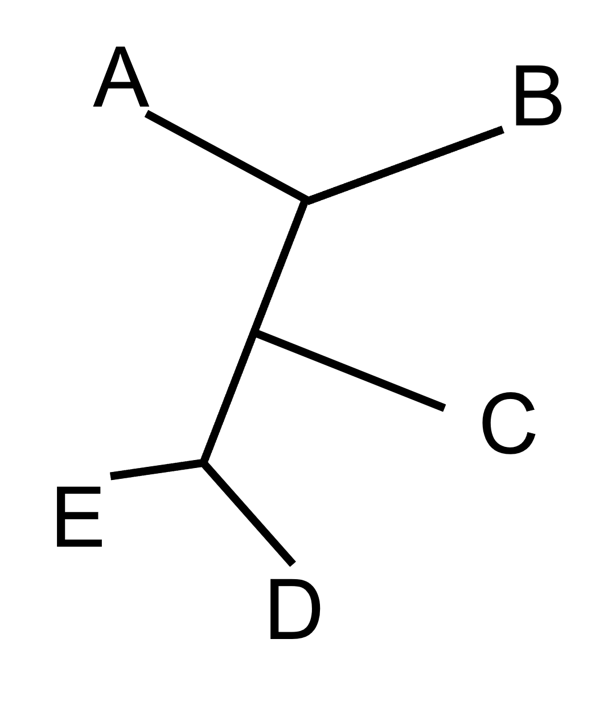

# (PART\*) NEIGHBOR JOINING {-}


# The neighbor joining method of tree estimation

There are two basic types of tree estimation methods: distance methods (which includes neighbor joining, discussed here) and tree-searching methods (which we will cover in later sections). The first phylogenetic trees were built using distance methods. Strictly speaking, these methods can be considered phenetic methods, not phylogenetic methods, since these methods group taxa based on similarity instead of attempting to find the most likely tree. For all practical purposes, though, we can include neighbor joining in under the umbrella of phylogenetics.

In distance-based methods like neighbor joining, the genetic data is converted into a distance matrix, which is used to group taxa based on the genetic distance between them. Neighbor joining specifically works via star decomposition. Let's take a look at an example (adapted from (Fred Opperdoes)[http://www.deduveinstitute.be/~opperd/private/neighbor.html]).

We have 5 taxa (A,B,C,D, and E) for which we would like to infer a phylogeny. We've calculated the following distances among all the taxa:


The shortest distance between any taxa is 13, which means that A and B are most closely related to each other and will form our first group. We begin with all the taxa forming a star shape, and then we add a branch that connects A and B.


We keep grouping taxa until the entire star has been resolved into bifurcating branches (nodes that connect two, and only two, branches). For our example tree, we eventually end up with this tree:





The neighbor joining method is very fast, requires very few computational resources, and is statistically consistent. It will also always result in only a single tree topology. Unfortunately, many people will become overly confident that the single neighbor joining tree is the true tree, which is not necessarily true. Nowadays, most researchers might start their analysis with a neighbor joining tree, but they generally go on to infer trees using one of the other methods. 

::: {.fyi}

There is another type of distance method you might hear about called UPGMA (unweighted pair group method with arithmetic mean). This is a hierarchical clustering method. However, the tree built using UPGMA depends greatly on the order in which the taxa are added, unlike the neighbor joining method (which will result in the same tree no matter what order the samples are added). As a result, the UPGMA method is almost never used in phylogenetics today.

:::


## Models of molecular evolution

In the example above, we kind of glossed over the process of converting DNA sequence into genetic distances. In its simplest form, every mutation is given a value, and the total value of all mutations is then used to calculate a genetic distance. 

But wait, you might be thinking. How do researchers decide what value to assign each mutation? Are all mutations given the same value, or do some changes "cost" more than others? Aren't some mutations considered more unlikely than others? These are all excellent questions that should be considered whenever dealing with phylogenetic analysis. Luckily, we don't have to answer all these questions ourselves. Instead, we can look at published _models of molecular evolution_ (also called substitution models) and decide which model fits our data the best.

### JC69

A model of molecular evolution is a set of rules that determines how much each mutation costs relative to all other mutations. One of the earliest published models is the JC69 model (sometimes written as JC), proposed by Jukes and Cantor in 1969. The JC69 model assumes equal base frequencies (that is, each nucleotide makes up 25% of the bases in the DNA sequence), as well as equal mutation rates. A mutation of an A to a T is the same as the mutation as a T to an A or an A to a C. As a result, the JC69 model has only 1 parameter - the mutation rate. 

### K2P

Many other models of molecular evolution have been published since JC69. One of the more popular ones is the Kimura two-parameter model (also called K80, or K2P). This model still assumes equal base frequencies, but allows for a distinct mutation rate for transitions (mutations between purines or pyrimidines) and a different mutation rate for tranversions (mutations from purine to pyrimidine, or vice versa). As you might have guessed from the name, this particular model has two parameters.

### GTR

One of the most complex models you might come across is the general time reversible model, or GTR. This model is extremely flexible but also parameter-heavy. There are no assumptions about base frequencies, and each possible mutation is given its own mutation rate. (A quick note: the mutation rate from A to G is the same as the mutation rate from G to A in this model.) As a result, this model has 9 parameters: 6 mutation rates + 3 base frequencies. (Because the sum of the 4 base frequencies must equal 1, we only have to describe 3 of them in order to calculate all 4. That's why we only need 3 parameters to model the base frequencies for GTR.)

### Other parameters

Sometimes you will run across a model that has "+ I" added to it (like GTR + I). The "I" refers to a invariant sites parameter. In these models, each base has a certain probability of being invariate, or unlikely to mutate. 

Another option you might see is using a gamma distribution to estimate how many times any given base in a sequence might mutate. We often think of mutation as a one-and-done process, where a nucleotide might mutate only once. This isn't a bad assumption; in fact, given that mutation is so rare, it is extremely unlikely for a nucleotide to mutate multiple times, though it does happen (particularly as divergence times between taxa increase). A solution to this dilemma is to include a parameter that describes how many times a particular nucleotide has undergone mutation. A gamma distribution is used because the highest probability is found in the smallest values of x, with a low probability of larger values of x (which would be multiple mutation hits at the same nucleotide). A model using a gamma distribution with have a "+ G".

Finally, some models with have a "+ SS" added to it. The SS indicates a site-specific variation parameter. These models will estimate different mutation rates for each codon position. Site-specific models are much less common than models that include invariate sites parameters or a \Gamma$ parameter.

### How do I choose a model?

There are enough substitution models out there that it can be a bit overwhelming to pick one for your phylogenetic analyses. (The models discussed above are in no way an exhaustive list.) Many researchers will have a favorite model they use, while others will rely model test programs to tell them which model of molecular evolution best fits their data. Although GTR + I + \Gamma$ might be the most biologically realistic model, it is also parameter-heavy and may not be the best choice when dealing with a sequence alignment that includes only a small number of phylogenetically-informative sites. 


```
## Determining distance matrix based on shared 10-mers:
## ================================================================================
## 
## Time difference of 0.01 secs
## 
## Clustering into groups by similarity:
## ================================================================================
## 
## Time difference of 0.01 secs
## 
## Aligning Sequences:
## ================================================================================
## 
## Time difference of 0.43 secs
## 
## Iteration 1 of 2:
## 
## Determining distance matrix based on alignment:
## ================================================================================
## 
## Time difference of 0 secs
## 
## Reclustering into groups by similarity:
## ================================================================================
## 
## Time difference of 0 secs
## 
## Realigning Sequences:
## ================================================================================
## 
## Time difference of 0.63 secs
## 
## Iteration 2 of 2:
## 
## Determining distance matrix based on alignment:
## ================================================================================
## 
## Time difference of 0 secs
## 
## Reclustering into groups by similarity:
## ================================================================================
## 
## Time difference of 0 secs
## 
## Realigning Sequences:
## ================================================================================
## 
## Time difference of 0.91 secs
## 
## Refining the alignment:
## ================================================================================
## 
## Time difference of 0.72 secs
```


# Building a neighbor joining tree

We are finally ready to start building trees from our data. 

For these analyses, we will use an R package called `phangorn`. If you'd like to learn more about it, you can find the manual [here](https://cran.r-project.org/web/packages/phangorn/phangorn.pdf).

`phangorn` (Phylogenetic Reconstruction and Analysis) is stored in the CRAN repository, so we will use `install.packages` for the installation.


```r
install.packages('phangorn')

library(phangorn)
```

## The phyDat object

`phangorn` uses a data structure called phyDat to store information. You can either load the fasta file of your alignment into a phyDat object, or you can directly convert the DNAbin object of your alignment into a phyDat object. You will also want to make sure you have access to your DNAbin object, since we will need that for the model testing.


```r
#Loading a fasta file

grass.phy <- read.phyDat('grass_aligned.fasta', format = 'fasta', type = 'DNA')

#Converting your DNAbin object

grass.align <- read.dna('grass_aligned.fasta', format = 'fasta')

grass.phy <- phyDat(grass.align)

grass.phy
```


```
## 13 sequences with 3381 character and 1238 different site patterns.
## The states are a c g t
```

The phyDat object is remarkably similar to the DNAbin object - this isn't too surprising, since the same team wrote both `ape` and `phangorn`.

::: {.fyi}
**R BASICS**

If you are pausing your R environment on AnVIL (or have not closed an R session), you may still have all the objects you created previously still available. To check this, you can use the `list` command.

ls()

R will print all the objects that are still stored in the workspace. If you see your aligned DNAbin object (which can also bee seen in the Environment tab in the upper right box of RStudio), you can directly convert it to a `phyDat` object instead of loading the fasta file first.
:::

## Choosing a substitution model

`phangorn` can test our data against 24 different substitution models to determine which is the best fit. We first have to create a "guide" tree. (In future releases of `phangorn` creating this tree won't be necessary, but for now it doesn't take much extra time to create a tree.)


```r
dist.matrix <- dist.dna(grass.align)

dist.matrix
```

```
##               JX915632  EF105403.1  DQ073553.1  FJ481575.1  EF204545.1
## EF105403.1 0.018503109                                                
## DQ073553.1 0.018486610 0.009175541                                    
## FJ481575.1 0.053465970 0.059763282 0.062250797                        
## EF204545.1 0.071054126 0.076242240 0.077482792 0.058401695            
## AJ314771.1 0.098387036 0.105024012 0.103575748 0.111726613 0.104200261
## FJ481569.1 0.066921872 0.068194138 0.069428145 0.079685257 0.083719318
## DQ073533.1 0.110258627 0.110258627 0.110174261 0.129491194 0.123022644
## AY804128.1 0.070891254 0.078663432 0.077301449 0.098013117 0.095612138
## AY303125.2 0.134898940 0.140451748 0.140345966 0.156127330 0.155399615
## KF887414.1 0.108883110 0.115798850 0.114317931 0.125235849 0.132797654
## D82941.1   0.229308574 0.234242825 0.230816281 0.245639168 0.252112954
## JX276655.1 0.220197471 0.226712222 0.223309915 0.233015149 0.226285267
##             AJ314771.1  FJ481569.1  DQ073533.1  AY804128.1  AY303125.2
## EF105403.1                                                            
## DQ073553.1                                                            
## FJ481575.1                                                            
## EF204545.1                                                            
## AJ314771.1                                                            
## FJ481569.1 0.116918944                                                
## DQ073533.1 0.157034064 0.105988312                                    
## AY804128.1 0.119801346 0.088583610 0.125139889                        
## AY303125.2 0.175826848 0.145832849 0.125235849 0.156008381            
## KF887414.1 0.147859497 0.107203382 0.121715409 0.133466274 0.139333101
## D82941.1   0.274378224 0.235622139 0.249510345 0.234105767 0.271596554
## JX276655.1 0.254310536 0.229714807 0.252112954 0.233162450 0.258487550
##             KF887414.1    D82941.1
## EF105403.1                        
## DQ073553.1                        
## FJ481575.1                        
## EF204545.1                        
## AJ314771.1                        
## FJ481569.1                        
## DQ073533.1                        
## AY804128.1                        
## AY303125.2                        
## KF887414.1                        
## D82941.1   0.249182286            
## JX276655.1 0.254834070 0.110258627
```

```r
str(dist.matrix)
```

```
##  'dist' num [1:78] 0.0185 0.0185 0.0535 0.0711 0.0984 ...
##  - attr(*, "Size")= int 13
##  - attr(*, "Labels")= chr [1:13] "JX915632" "EF105403.1" "DQ073553.1" "FJ481575.1" ...
##  - attr(*, "Upper")= logi FALSE
##  - attr(*, "Diag")= logi FALSE
##  - attr(*, "call")= language dist.dna(x = grass.align)
##  - attr(*, "method")= chr "K80"
```

The distance matrix stores all the distances in the lower half of the table to save space. This particular matrix used the K80 model (also known as the K2P model) to calculate the distances. When we use the `str(dist.matrix)` command, we can see the model used stored in the method attribute.

Next, we make a very quick neighbor joining tree to act as the guide tree. We then run the model test command using our phyDat object and the guide tree.


```r
tree.guide <- NJ(dist.matrix)

mod.test <- modelTest(grass.phy, tree = tree.guide)
```

```
## [1] "JC+I"
## [1] "JC+G"
## [1] "JC+G+I"
## [1] "F81+I"
## [1] "F81+G"
## [1] "F81+G+I"
## [1] "K80+I"
## [1] "K80+G"
## [1] "K80+G+I"
## [1] "HKY+I"
## [1] "HKY+G"
## [1] "HKY+G+I"
## [1] "SYM+I"
## [1] "SYM+G"
## [1] "SYM+G+I"
## [1] "GTR+I"
## [1] "GTR+G"
## [1] "GTR+G+I"
```

As the model test runs, R prints out most of the models being tested. For some reason, R doesn't print the basic models. The first three models listed are JC + I, JC + G, and JC + G + I. While these models are being tested, the program is _also_ testing the basic JC model.


```r
mod.test
```

```
##      Model df    logLik      AIC          AICw     AICc         AICcw      BIC
## 1       JC 23 -12889.65 25825.30 2.700386e-211 25825.63 3.157131e-211 25966.20
## 2     JC+I 24 -12848.73 25745.47 5.846250e-194 25745.82 6.737694e-194 25892.49
## 3     JC+G 24 -12841.04 25730.08 1.284266e-190 25730.43 1.480093e-190 25877.10
## 4   JC+G+I 25 -12841.04 25732.08 4.724094e-191 25732.46 5.363607e-191 25885.23
## 5      F81 26 -12712.05 25476.11 1.807454e-135 25476.53 2.020447e-135 25635.38
## 6    F81+I 27 -12670.12 25394.24 1.083122e-117 25394.69 1.191340e-117 25559.64
## 7    F81+G 27 -12661.52 25377.04 5.877060e-114 25377.49 6.464260e-114 25542.44
## 8  F81+G+I 28 -12661.52 25379.04 2.161804e-114 25379.53 2.338246e-114 25550.57
## 9      K80 24 -12675.91 25399.82 6.659747e-119 25400.18 7.675234e-119 25546.84
## 10   K80+I 25 -12625.77 25301.54  1.460748e-97 25301.93  1.658493e-97 25454.69
## 11   K80+G 25 -12615.42 25280.84  4.559902e-93 25281.23  5.177187e-93 25433.99
## 12 K80+G+I 26 -12615.42 25282.84  1.677274e-93 25283.26  1.874926e-93 25442.12
## 13     HKY 27 -12490.04 25034.08  1.748144e-39 25034.53  1.922808e-39 25199.48
## 14   HKY+I 28 -12441.45 24938.91  8.118092e-19 24939.39  8.780675e-19 25110.43
## 15   HKY+G 28 -12430.70 24917.40  3.787695e-14 24917.89  4.096840e-14 25088.93
## 16 HKY+G+I 29 -12430.70 24919.40  1.393244e-14 24919.92  1.480992e-14 25097.06
## 17     SYM 28 -12666.82 25389.65 1.076040e-116 25390.13 1.163864e-116 25561.17
## 18   SYM+I 29 -12619.36 25296.72  1.621861e-96 25297.24  1.724008e-96 25474.38
## 19   SYM+G 29 -12609.63 25277.27  2.724038e-92 25277.79  2.895602e-92 25454.92
## 20 SYM+G+I 30 -12609.63 25279.27  1.001914e-92 25279.82  1.046030e-92 25463.04
## 21     GTR 31 -12462.58 24987.15  2.709162e-29 24987.74  2.776339e-29 25177.06
## 22   GTR+I 32 -12406.95 24877.89  1.439643e-05 24878.52  1.447278e-05 25073.92
## 23   GTR+G 32 -12396.11 24856.22  7.310833e-01 24856.85  7.349605e-01 25052.25
## 24 GTR+G+I 33 -12396.11 24858.22  2.689024e-01 24858.89  2.650250e-01 25060.38
```

`phangorn` calculates multiple statistics that can be used to judge the fit of all the models. Which one you choose depends on what you prefer, although the field standard is generally to use the Akaike Information Criterion. This is a single number that combines how well the model fits the data (as determined by the log likelihood score) with a penalty for increasing model complexity. More complex models will almost always fit the data better, but in small datasets it can be difficult to get good estimates of every parameter when the model is complex. With AIC, we might find the GTR + G + I model fits the best, but we only have enough samples to estimates 2 parameters with any confidence. In this case, the AIC score might tell us to use the K80 (K2P) model.

Smaller numbers are better when it comes to AIC. This is also the case for AICc (which is a "second generation" or updated calculate of AIC) and BIC (the Bayesian Information Criterion, a version of AIC that includes a stronger penalty for additional parameters). In RStudio, you canclick on "mod.test" in the Environment tab from the pane in the upper right corner. That will open the results of our model test analysis in a separate window. If we click on "AIC" or "AICc", we can order the models by the AIC values. When we do this, we see the lowest AIC and AICc values are for the GTR + G model, which is what we will use going forward.

## Building the neighbor joining tree

We've already calculated a distance matrix above, but this time we will specify the model we want to use. 


```r
dist.matrix <- dist.dna(grass.align, model = "GTR + G")

tree <- NJ(dist.matrix)
tree
```

But wait, why are we getting an error message? As it turns out, the `modelTest` command might test 24 different models, but the `dist.dna` command can't use all of those models. This is frustrating but also not uncommon when doing phylogenetic analyses. Unfortunately, not every program supports every substitution model.

`dist.dna` appears to support the following models: RAW, JC69, K80, F81, K81, F84, T92, TN93, GG95, LOGDET, BH87, PARALIN, N, TS, TV, INDEL, INDELBLOCK. We can check which of these models has the lowest AIC from our earlier model test. Surprisingly, it's the K80 model, which is what we used initially.


```r
dist.matrix <- dist.dna(grass.align, model = "K80")

tree <- NJ(dist.matrix)
```

## Visualizing the neighbor joining tree

Let's take a look at the neighbor joining tree.


```r
plot(tree, type = "unrooted")
```


While we have indeed generated a tree, it's not really the easiest to interpret at the moment. It's hard to see what the relationships among taxa are because the tips are labeled with GenBank accession numbers instead of taxa names. Also, we really ought to declare an outgroup.

First let's change the tip labels. This is simply a matter of replacing each accession number with the taxon name. We do this by creating a vector of taxon names (matching the order of the accession numbers), then replacing the `tip.label` variable in our `tree` object. Because most of us are not plant experts, we'll use the common names for each sample, but it's also acceptable to use the scientific names.


```r
tree$tip.label
```

```
##  [1] "JX915632"   "EF105403.1" "DQ073553.1" "FJ481575.1" "EF204545.1"
##  [6] "AJ314771.1" "FJ481569.1" "DQ073533.1" "AY804128.1" "AY303125.2"
## [11] "KF887414.1" "D82941.1"   "JX276655.1"
```

```r
new.labels <- c('wheat', 'intermediate wheatgrass', 'mammoth wild rye', 'wheatgrass', 'tall wheatgrass', 'rye', 'Asiatic grass', 'crested wheatgrass', 'Tauschs goatgrass', 'medusahead rye', 'mosquito grass', 'barley_D-hordein', 'Siberian wild rye_D-hordein' )

tree$tip.label <- new.labels
```

Next, we declare our outgroup (in this case, the two D-hordein samples) and root our tree. (Remember, we did this in our first exercise using R.)


```r
tree.root <- root(tree, outgroup = c('barley_D-hordein','Siberian wild rye_D-hordein'))

plot(tree.root, type = "phylogram", main = 'Neighbor Joining, Glu-1')
```


Now we have a tree that we can begin to make sense of. To an non-botanist, it seems interesting the samples with the common name "wheatgrass" don't appear to be clustering together. Common names can be misleading about phylogenetic relationships!

## Saving your trees

You want to be sure to save the rooted tree and model test results to the persistent disk.


```r
write.tree(tree.root, file = 'nj_grass.tre')
write.table(mod.test, file = 'grass_model_test', quote=F, sep='\t')
```


```r
sessionInfo()
```

```
## R version 4.0.2 (2020-06-22)
## Platform: x86_64-pc-linux-gnu (64-bit)
## Running under: Ubuntu 20.04.3 LTS
## 
## Matrix products: default
## BLAS/LAPACK: /usr/lib/x86_64-linux-gnu/openblas-pthread/libopenblasp-r0.3.8.so
## 
## locale:
##  [1] LC_CTYPE=en_US.UTF-8       LC_NUMERIC=C              
##  [3] LC_TIME=en_US.UTF-8        LC_COLLATE=en_US.UTF-8    
##  [5] LC_MONETARY=en_US.UTF-8    LC_MESSAGES=C             
##  [7] LC_PAPER=en_US.UTF-8       LC_NAME=C                 
##  [9] LC_ADDRESS=C               LC_TELEPHONE=C            
## [11] LC_MEASUREMENT=en_US.UTF-8 LC_IDENTIFICATION=C       
## 
## attached base packages:
## [1] stats4    parallel  stats     graphics  grDevices utils     datasets 
## [8] methods   base     
## 
## other attached packages:
## [1] phangorn_2.5.5      DECIPHER_2.18.1     RSQLite_2.2.1      
## [4] Biostrings_2.58.0   XVector_0.30.0      IRanges_2.24.1     
## [7] S4Vectors_0.28.1    BiocGenerics_0.36.1 ape_5.4-1          
## 
## loaded via a namespace (and not attached):
##  [1] Rcpp_1.0.8      highr_0.8       pillar_1.4.6    compiler_4.0.2 
##  [5] jquerylib_0.1.4 tools_4.0.2     zlibbioc_1.36.0 bit_4.0.4      
##  [9] digest_0.6.25   memoise_1.1.0   evaluate_0.14   lifecycle_1.0.0
## [13] tibble_3.0.3    nlme_3.1-149    lattice_0.20-41 pkgconfig_2.0.3
## [17] rlang_0.4.10    igraph_1.2.6    fastmatch_1.1-0 Matrix_1.2-18  
## [21] DBI_1.1.0       yaml_2.2.1      xfun_0.26       stringr_1.4.0  
## [25] knitr_1.33      fs_1.5.0        vctrs_0.3.4     hms_0.5.3      
## [29] bit64_4.0.5     grid_4.0.2      R6_2.4.1        ottrpal_0.1.2  
## [33] rmarkdown_2.10  bookdown_0.24   blob_1.2.1      readr_1.4.0    
## [37] magrittr_2.0.2  ellipsis_0.3.1  htmltools_0.5.0 quadprog_1.5-8 
## [41] stringi_1.5.3   crayon_1.3.4
```

