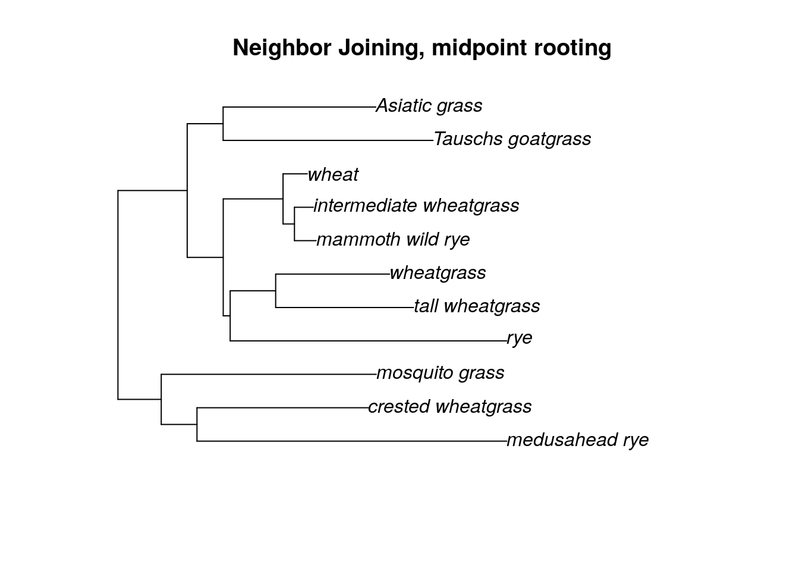
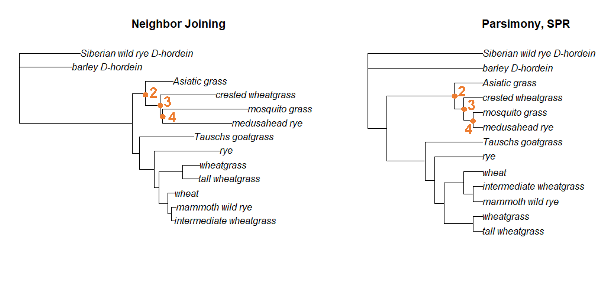

# (PART\*) MORE TREE THINKING {-}


# More Phylogenetics Basics

Now that you've had a chance to build several phylogenies, let's spend some time examining what the trees are telling us.

## Tree topology

In an earlier chapter, we talked about nodes and clades. As a reminder, a node is the place where two branches connect. Each node represents a hypothesized most recent common ancestor of the taxa on the tips of the branches. 


In this tree (the grass neighbor joining tree), the node marked in purple connects all the ingroup samples. (The ingroup for this tree are all grass _Glu-1_ samples.) We can assume the most recent common ancestor (MRCA) of the ingroup would have existed at this node. The ingroup here is a an example of **monophyly**; a monophyletic clade is a clade that contains all the descendants of a particular ancestor.


There are two other terms that describe clades you might run across. **Paraphyly** describes a group that contains some (but not all) of the descendants of a node; in the figure above, the highlighted clade is paraphyletic with respect to the node marked with a purple dot. **Polyphyly** describes a group that contains both descendants and non-descendants of a node. In the grass example, the paraphyletic group contains both the outgroup taxa and a subset of the ingroup.

## Outgroups

The choice of the two outgroup taxa (Siberian wild rye D-hordein and barley D-hordein) turned out to be a good decision for the grass tree. First, these two taxa are monophyletic compared to the other samples (that is, they share a recent common ancestor, and the ingroup is monophyletic compared to them). Second, the branch lengths for the two outgroup taxa is similar to the branch lengths of all the ingroup taxa.  If the branch lengths for the outgroup taxa are too long, the relationships among all the grass _Glu-1_ samples will be obscured.

However, what if our first outgroup choice hadn't been quite right? In that case, we could edit the fasta file to remove any samples that we needed. 

Let's pretend the outgroup wasn't monophyletic and that instead the Siberian wild rye D-hordein sample actually fell within the ingroup. In this case, we could simply remove that sample using the `phylotools` package.


```r
library(phylotools)

rm.sequence.fasta(infile = "grass_aligned-renamed.fasta", outfile = "sequence.removed.fasta", to.rm = "Siberian wild rye_D-hordein")
```

```
## sequence.removed.fasta has been saved to  /__w/AnVIL_Phylogenetic-Techniques/AnVIL_Phylogenetic-Techniques
```

We can then load the new fasta file and estimate a new neighbor joining tree (or any other type of tree) without the problematic sample.


```r
library(phangorn)

grass.new <- read.dna("sequence.removed.fasta", format='fasta')

dist.matrix <- dist.dna(grass.new, model = "K80")

tree <- NJ(dist.matrix)
tree.root <- root(tree, outgroup = 'barley_D-hordein')

plot(tree.root, main = "edited Neighbor Joining")
```


You can use the same command to remove multiple outgroup taxa, or to remove an outgroup that is too distant (ie, the branch lengths are too long and including the outgroup is obscuring the relationships among the ingroup samples). If you need to remove all of your outgroup, you can instead try midpoint rooting. 


```r
rm.sequence.fasta(infile = "grass_aligned-renamed.fasta", outfile = "no_outgroup.fasta", to.rm = c("barley_D-hordein", "Siberian wild rye_D-hordein"))
```

```
## no_outgroup.fasta has been saved to  /__w/AnVIL_Phylogenetic-Techniques/AnVIL_Phylogenetic-Techniques
```

```r
grass.no_out<- read.dna("no_outgroup.fasta", format='fasta')

dist.matrix <- dist.dna(grass.no_out, model = "K80")

tree.no_out <- NJ(dist.matrix)

tree.no_out <- midpoint(tree.no_out)

plot(tree.no_out, main = "Neighbor Joining, midpoint rooting")
```



## Comparing trees

When we are trying to determine if two trees are telling us the same thing about the relationships among our samples (that is, the topologies of the two trees are identical), we might compare the descendants of each node. If the descendants of each node are the same, then we know the topologies are the same (even if the order of the clades are not identical - remember, branches can rotate around nodes). We'll use the grass phylogenies as an example


First, we can see that node 1 (the node that connects all the ingroup branches) exists in both trees.





The same is true for the node that connects Asiatic grass to the crested wheatgrass/mosquito grass/medusahead rye clade, as well as the nodes resolving the relationships among that that clade.


Moving to the bottom of the tree, we can also locate nodes 5, 6, and 7 in both trees. Each of these nodes connects all the same descendants in each tree.


Finally, we can identify the presence of nodes 8, 9, and 10 in both trees. This is a little trickier to see, because the branches have rotated. But we can find a node that unites wheat, mammoth wild rye, and intermediate wheatgrass (node 8) as well as a node that unites only mammoth wild rye and intermediate wheatgrass (node 9). We also have a separate node that unites wheatgrass and tall wheatgrass (node 10). 

Since all of the ingroup nodes are the same, we know the topologies of the neighbor joining and parsimony trees are the same. However, it's a bit tedious to go through and label each node. Luckily, we can use R to compare topologies more quickly. Open the `ape` library and load your saved trees into the console.


```r
library(ape)

nj.tree <- read.tree("nj_grass.tre")
spr.tree <- read.tree("spr_grass.tre")
nni.tree <- read.tree("nni_grass.tre")
```

The `ape` package has a very useful `all.equal` command (you can see more details about it [here](https://rdrr.io/cran/ape/man/all.equal.phylo.html)). This command allows us to compare topologies.


```r
all.equal(spr.tree, nj.tree, use.edge.length = F)
```

```
## [1] TRUE
```

The first two arguments are the trees we'd like to compare. In order to compare just the topologies, we also include the argument `use.edge.length=F`, which tells the `all.equal` command to ignore branch lengths.

If we want to tell whether trees are completely identical (that is, both the topologies and the branch lengths are the same), we can change the last argument to T. (Alternatively, we could leave the last argument off entirely, as the default setting is for `use.edge.length` is T.)


```r
all.equal(spr.tree, nj.tree, use.edge.length = T)
```

```
## [1] FALSE
```

Not surprisingly, the branch lengths differ between the neighbor joining and SPR parsimony tree. However, maybe the branch lengths are the same between the two trees we estimated using parsimony.


```r
all.equal(spr.tree, nni.tree)
```

```
## [1] FALSE
```

Well, now we know the two parsimony trees aren't completely identical. However, what if this is because the topologies aren't the same?


```r
all.equal(spr.tree, nni.tree, use.edge.length = F)
```

```
## [1] TRUE
```

By running the `all.equal` command again, we can verify the topologies are the same, so these two trees must differ in just the branch length estimates.


```r
sessionInfo()
```

```
## R version 4.0.2 (2020-06-22)
## Platform: x86_64-pc-linux-gnu (64-bit)
## Running under: Ubuntu 20.04.3 LTS
## 
## Matrix products: default
## BLAS/LAPACK: /usr/lib/x86_64-linux-gnu/openblas-pthread/libopenblasp-r0.3.8.so
## 
## locale:
##  [1] LC_CTYPE=en_US.UTF-8       LC_NUMERIC=C              
##  [3] LC_TIME=en_US.UTF-8        LC_COLLATE=en_US.UTF-8    
##  [5] LC_MONETARY=en_US.UTF-8    LC_MESSAGES=C             
##  [7] LC_PAPER=en_US.UTF-8       LC_NAME=C                 
##  [9] LC_ADDRESS=C               LC_TELEPHONE=C            
## [11] LC_MEASUREMENT=en_US.UTF-8 LC_IDENTIFICATION=C       
## 
## attached base packages:
## [1] stats     graphics  grDevices utils     datasets  methods   base     
## 
## other attached packages:
## [1] phangorn_2.5.5   phylotools_0.2.2 ape_5.4-1       
## 
## loaded via a namespace (and not attached):
##  [1] igraph_1.2.6    Rcpp_1.0.8      knitr_1.33      magrittr_2.0.2 
##  [5] hms_0.5.3       lattice_0.20-41 R6_2.4.1        quadprog_1.5-8 
##  [9] rlang_0.4.10    fastmatch_1.1-0 highr_0.8       stringr_1.4.0  
## [13] tools_4.0.2     parallel_4.0.2  grid_4.0.2      nlme_3.1-149   
## [17] xfun_0.26       jquerylib_0.1.4 htmltools_0.5.0 ellipsis_0.3.1 
## [21] ottrpal_0.1.2   yaml_2.2.1      digest_0.6.25   tibble_3.0.3   
## [25] lifecycle_1.0.0 crayon_1.3.4    bookdown_0.24   Matrix_1.2-18  
## [29] readr_1.4.0     vctrs_0.3.4     fs_1.5.0        evaluate_0.14  
## [33] rmarkdown_2.10  stringi_1.5.3   compiler_4.0.2  pillar_1.4.6   
## [37] pkgconfig_2.0.3
```

