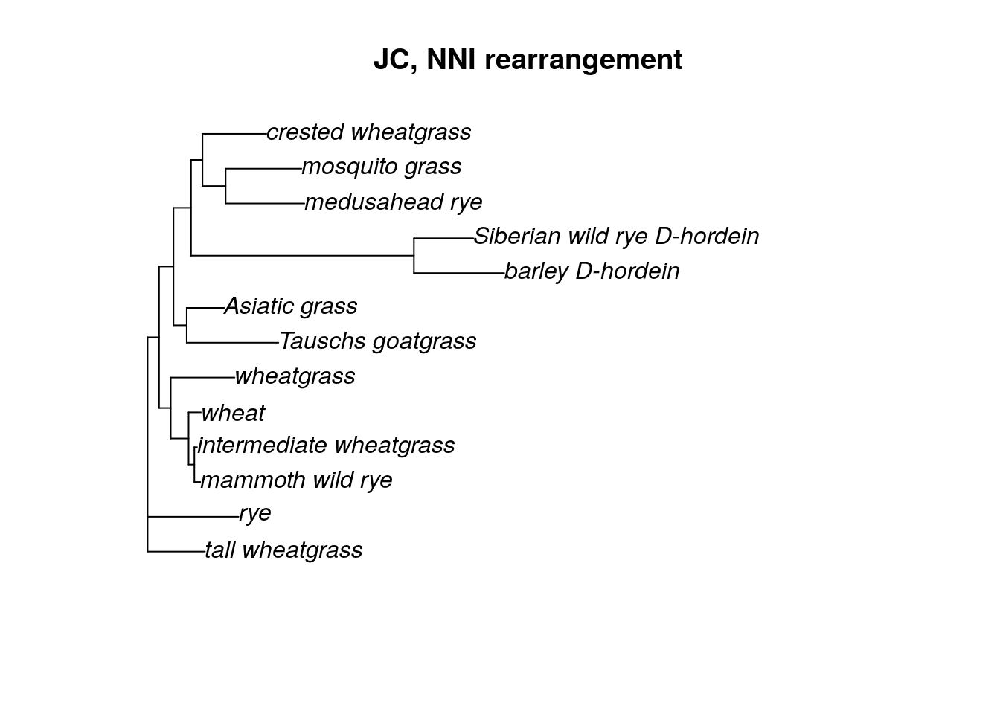
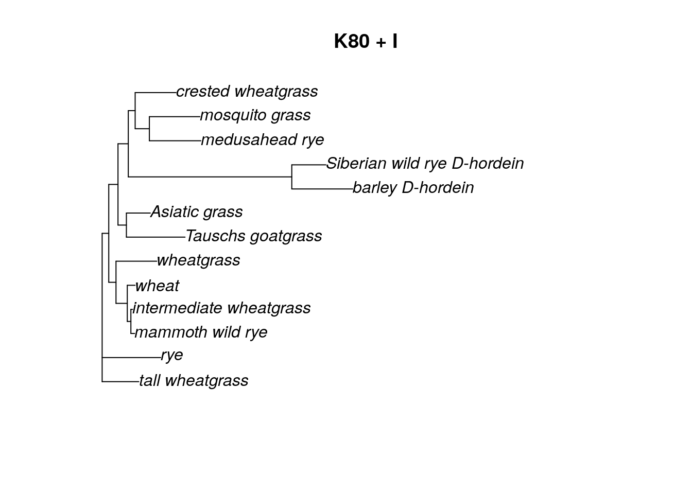

# (PART\*) MAXIMUM LIKELIHOOD {-}


# What is Maximum Likelihood?

We are finally ready to try estimating trees using a true phylogenetic method. Maximum likelihood is a tree-searching method that attempts to find a tree that maximizes the likelihood of observing the data. Put another way, we want a tree that makes the data we see likely. If you've ever done any sort of statistical test (like a linear regression or a chi-square test), you've been doing maximum likelihood tests. 

Essentially, for each possible DNA mutation you've seen in the data, you are finding a tree that recreates the most likely pattern of mutation that you see in your data. This includes limiting the amount of homoplasy or mutational reversals.

Maximum likelihood searches are tree-based searches (like parsimony). You supply a starting tree, and the algorithm estimates the likelihood of that tree given the data. (The likelihood value is often very small, so we transform it using to the loglikelihood for ease.) Then the algorithm permutates (or changes) the tree and calculates the likelihood of the new tree. If the new tree has a better likelihood, then it is kept and another permutation is tried. If the likelihood of the new tree is worse than the original tree, then the new tree is discarded and the algorithm tries a different permutation on the old tree.

The advent of the maximum likelihood method (published by Joe Felsenstein in 1981) revolutionized the field of evolutionary biology and really kickstarted the creation of phylogenetics as it exists today. 


# Estimating a tree using Maximum Likelihood

We will be using the `phangorn` package in R to estimate maximum likelihood methods. 

`phangorn` has three possible tree permutation methods available in its maximum likelihood commands. The first is the nearest neighbor interchange (NNI) method, which we used in our parsimony estimation. However, the NNI algorithm can sometimes get stuck on a local optimum in tree space (especially as the tree gets larger). The other two (the stochastic approach and the likelihood ratchet) will make random NNI rearrangements to the tree, which can allow the tree to escape local optima and instead find a global optimum of our tree-searching space.


## Creating a starting tree

`phangorn` requires a starting tree for maximum likelihood searches. The tree itself doesn't matter much, but generally people supply a neighbor joining tree because they can be generated quickly. 


```r
library(phangorn)

grass.align <- read.phyDat("grass_aligned-renamed.fasta", format = "fasta")

dist <- dist.ml(grass.align)
nj.tree <- nj(dist)
```

You can also upload your previously-generated neighbor joining tree and use that instead of creating a new one (just make sure that you used the same sample names in both your renamed fasta file and your neighbor joining tree).


```r
nj.tree <- read.tree("nj.tre")
```


## Calculating likelihood score

Once you have both a tree and your fasta file loaded, you can calculated a likelihood score using the `pml` command.


```r
fit <- pml(nj.tree, data = grass.align)
fit
```

```
## 
##  loglikelihood: -12912.73 
## 
## unconstrained loglikelihood: -20560.86 
## 
## Rate matrix:
##   a c g t
## a 0 1 1 1
## c 1 0 1 1
## g 1 1 0 1
## t 1 1 1 0
## 
## Base frequencies:  
## 0.25 0.25 0.25 0.25
```

One of the nice things about the `pml` output is that it includes the details of the substitution model used in the likelihood calculation. In this case, because we did not specify any model, the Jukes-Cantor (JC, or JC69) was used by default. We can tell this because the base frequencies are all 0.25 and there is only one substitution rate used in the rate matrix.

This output also reports both a log likelihood and an unconstrained log likelihood. The difference between the two values has to do with the size of the parameter space being searched. In my experience, the log likelihood (not the unconstrained log likelihood) is usually reported, though either is fine as long as you are consistent when testing multiple models.

## Optimizing the maximum likelihood parameters

The `pml` command simply calculates the likelihood of the data, given a tree. If we want to find the optimum tree (and we do), we need to optimize the tree topology (as well as branch length estimates) for our data. We can do this using the `optim.pml` command. For this particular model (JC), we simply need to supply a `pml` object (which we created above) and decide what type of tree arrangement we want to do.


```r
fitJC <- optim.pml(fit, rearrangement = "NNI")
```

```
## optimize edge weights:  -12912.73 --> -12865.23 
## optimize edge weights:  -12865.23 --> -12865.23 
## optimize topology:  -12865.23 --> -12851.07 
## optimize topology:  -12851.07 --> -12849.71 
## optimize topology:  -12849.71 --> -12849.71 
## 2 
## optimize edge weights:  -12849.71 --> -12849.71 
## optimize topology:  -12849.71 --> -12849.71 
## 0 
## optimize edge weights:  -12849.71 --> -12849.71
```

```r
plot(fitJC$tree, main = "JC, NNI rearrangement")
```



With the choice of NNI rearrangement, you can see that only a few moves were necessary in order to find the ML tree. We can also choose a "stochastic" or "ratchet" (likelihood ratchet) tree rearrangement algorithm. I like to use the stochastic rearrangement.

Using either the stochastic or ratchet tree rearrangement takes more time than NNI. Here I've also added a command to hide the output while the algorithm is running, but feel free to leave it off so you can see what the algorithm is doing!


```r
fitJC <- optim.pml(fit, rearrangement = "stochastic", control = pml.control(trace = 0))
plot(fitJC$tree, main = "JC, stochastic rearrangement")
```


## Changing the model for your ML search

All the work above is for the Jukes-Cantor model. However, there is a whole world of other substition models out there, and it would be nice to use them as well. We can update the `pml` object "fit" with other models.

According to the model test we ran on the grass data in the Neighbor Joining section, the best model for this dataset is the GTR + G model. The gamma distribution has two parameters, a shape parameter and a scale parameter. In phylogenetics, we commonly think of these as the number of rate categories and a shape parameter. When adding a gamma distribution, we can just specify the number of rate categories to start. The standard is 4.


```r
fitGTR.G <- update(fit, model = "GTR", k = 4)
fitGTR.G
```

```
## 
##  loglikelihood: -12888.65 
## 
## unconstrained loglikelihood: -20560.86 
## Discrete gamma model
## Number of rate categories: 4 
## Shape parameter: 1 
## 
## Rate matrix:
##   a c g t
## a 0 1 1 1
## c 1 0 1 1
## g 1 1 0 1
## t 1 1 1 0
## 
## Base frequencies:  
## 0.25 0.25 0.25 0.25
```

After we update the model and add the gamma distribution, we can see that fitGTR now 4 rate categories and a shape parameter = 1. However, the rate matrix and base frequencies are still the same as the JC model, because we did not update those. We could if we wanted to, but it's easier to let the `optim.pml` algorithm do it.


```r
fitGTR.G <- optim.pml(fitGTR.G, model = "GTR", optGamma = T, rearrangement = "stochastic", control = pml.control(trace = 0))

fitGTR.G
```

```
## 
##  loglikelihood: -12364.36 
## 
## unconstrained loglikelihood: -20560.86 
## Discrete gamma model
## Number of rate categories: 4 
## Shape parameter: 1.373376 
## 
## Rate matrix:
##           a         c         g        t
## a 0.0000000 0.3822941 1.4796329 0.698245
## c 0.3822941 0.0000000 0.4572515 2.225412
## g 1.4796329 0.4572515 0.0000000 1.000000
## t 0.6982450 2.2254116 1.0000000 0.000000
## 
## Base frequencies:  
## 0.3183583 0.2986886 0.2541144 0.1288387
```

```r
plot(fitGTR.G$tree, main = "GTR + G")
```


We can also update the model to include an invariant sites parameter (inv = 0.2).


```r
fitGTR.G.I <- update(fitGTR.G, inv = 0.2)

fitGTR.G.I <- optim.pml(fitGTR.G.I, model = "GTR", optGamma = T, optInv = T,  rearrangement = "stochastic", control = pml.control(trace = 0))

fitGTR.G.I
```

```
## 
##  loglikelihood: -12364.36 
## 
## unconstrained loglikelihood: -20560.86 
## Proportion of invariant sites: 4.473901e-05 
## Discrete gamma model
## Number of rate categories: 4 
## Shape parameter: 1.372046 
## 
## Rate matrix:
##           a         c         g         t
## a 0.0000000 0.3814506 1.4763826 0.6968408
## c 0.3814506 0.0000000 0.4562831 2.2228881
## g 1.4763826 0.4562831 0.0000000 1.0000000
## t 0.6968408 2.2228881 1.0000000 0.0000000
## 
## Base frequencies:  
## 0.3185034 0.2985722 0.2541684 0.1287559
```

```r
plot(fitGTR.G.I$tree, main = "GTR + I + G")
```


Keep in mind that we never want to overwrite our original "fit" object. By updating the "fit" object (and saving the update by a new name), we can easily go back and change the model for our ML estimation. Let's try a K80 (Kimura 2-parameter) model with an invariant sites parameter. In the `optim.pml` command, we can leave out the `optGamma = T` argument because we no longer have a gamma distribution included in the model.


```r
fitK80.I <- update(fit, model = "K80", inv = 0.2)

fitK80.I <- optim.pml(fitK80.I, model = "K80", optInv = T,  rearrangement = "stochastic", control = pml.control(trace = 0))

fitK80.I
```

```
## 
##  loglikelihood: -12592.47 
## 
## unconstrained loglikelihood: -20560.86 
## Proportion of invariant sites: 0.2469051 
## 
## Rate matrix:
##         a       c       g       t
## a 0.00000 1.00000 3.02753 1.00000
## c 1.00000 0.00000 1.00000 3.02753
## g 3.02753 1.00000 0.00000 1.00000
## t 1.00000 3.02753 1.00000 0.00000
## 
## Base frequencies:  
## 0.25 0.25 0.25 0.25
```

```r
plot(fitK80.I$tree, main = "K80 + I")
```



## Bootstrapping the ML tree

Once we have decided which ML tree fits the data best (we can do so by choosing the one with the biggest log likelihood value), we can estimate the support for each branch in the tree with bootstrapping. Bootstrapping for ML trees can be _very, very_ slow, so be patient!

Ideally we want to do at least 1000 bootstrap replicates. Many guides will set the number of bootstrap replicates to 100, but this is often chosen for speed. We really need at least 1000 replicates to have any sort of trust in the values.

We will use the `bootstrap.pml` command, which does have an option to estimate trees in parallel, which can help speed up the bootstrapping process. This option doesn't appear to work on Windows machines, but it works fine on AnVIL. Using AnVIL itself will also help speed up the estimation.

Let's try bootstrapping the GTR + G tree, which was the model chosen for us using the `modelTest` command.


```r
bs <- bootstrap.pml(fitGTR.G, bs=1000, multicore = T, optNni=TRUE,
+                     control = pml.control(trace = 0))
```


```r
bs <- bootstrap.pml(fitGTR.G, bs=100, optNni=TRUE, control = pml.control(trace = 0))
```

```
## Final p-score 1853 after  0 nni operations 
## Final p-score 1775 after  1 nni operations 
## Final p-score 1869 after  0 nni operations 
## Final p-score 1806 after  2 nni operations 
## Final p-score 1789 after  4 nni operations 
## Final p-score 1821 after  0 nni operations 
## Final p-score 1791 after  0 nni operations 
## Final p-score 1799 after  1 nni operations 
## Final p-score 1737 after  0 nni operations 
## Final p-score 1667 after  2 nni operations 
## Final p-score 1824 after  0 nni operations 
## Final p-score 1755 after  0 nni operations 
## Final p-score 1718 after  0 nni operations 
## Final p-score 1815 after  0 nni operations 
## Final p-score 1795 after  5 nni operations 
## Final p-score 1831 after  2 nni operations 
## Final p-score 1865 after  1 nni operations 
## Final p-score 1720 after  0 nni operations 
## Final p-score 1818 after  1 nni operations 
## Final p-score 1832 after  0 nni operations 
## Final p-score 1659 after  2 nni operations 
## Final p-score 1816 after  2 nni operations 
## Final p-score 1775 after  0 nni operations 
## Final p-score 1813 after  0 nni operations 
## Final p-score 1820 after  1 nni operations 
## Final p-score 1722 after  1 nni operations 
## Final p-score 1847 after  1 nni operations 
## Final p-score 1855 after  1 nni operations 
## Final p-score 1781 after  1 nni operations 
## Final p-score 1758 after  5 nni operations 
## Final p-score 1856 after  2 nni operations 
## Final p-score 1837 after  1 nni operations 
## Final p-score 1812 after  0 nni operations 
## Final p-score 1793 after  0 nni operations 
## Final p-score 1797 after  0 nni operations 
## Final p-score 1765 after  2 nni operations 
## Final p-score 1820 after  0 nni operations 
## Final p-score 1757 after  1 nni operations 
## Final p-score 1795 after  5 nni operations 
## Final p-score 1775 after  0 nni operations 
## Final p-score 1801 after  0 nni operations 
## Final p-score 1800 after  0 nni operations 
## Final p-score 1797 after  1 nni operations 
## Final p-score 1878 after  2 nni operations 
## Final p-score 1851 after  2 nni operations 
## Final p-score 1814 after  0 nni operations 
## Final p-score 1754 after  0 nni operations 
## Final p-score 1862 after  1 nni operations 
## Final p-score 1850 after  0 nni operations 
## Final p-score 1781 after  1 nni operations 
## Final p-score 1735 after  2 nni operations 
## Final p-score 1842 after  2 nni operations 
## Final p-score 1834 after  0 nni operations 
## Final p-score 1827 after  2 nni operations 
## Final p-score 1799 after  5 nni operations 
## Final p-score 1782 after  2 nni operations 
## Final p-score 1747 after  2 nni operations 
## Final p-score 1819 after  2 nni operations 
## Final p-score 1776 after  0 nni operations 
## Final p-score 1786 after  1 nni operations 
## Final p-score 1872 after  2 nni operations 
## Final p-score 1814 after  0 nni operations 
## Final p-score 1762 after  0 nni operations 
## Final p-score 1742 after  7 nni operations 
## Final p-score 1808 after  1 nni operations 
## Final p-score 1827 after  3 nni operations 
## Final p-score 1774 after  0 nni operations 
## Final p-score 1896 after  2 nni operations 
## Final p-score 1789 after  2 nni operations 
## Final p-score 1818 after  2 nni operations 
## Final p-score 1880 after  0 nni operations 
## Final p-score 1749 after  1 nni operations 
## Final p-score 1823 after  5 nni operations 
## Final p-score 1822 after  1 nni operations 
## Final p-score 1780 after  0 nni operations 
## Final p-score 1725 after  11 nni operations 
## Final p-score 1820 after  2 nni operations 
## Final p-score 1790 after  3 nni operations 
## Final p-score 1767 after  2 nni operations 
## Final p-score 1722 after  0 nni operations 
## Final p-score 1822 after  1 nni operations 
## Final p-score 1819 after  2 nni operations 
## Final p-score 1745 after  0 nni operations 
## Final p-score 1792 after  0 nni operations 
## Final p-score 1807 after  2 nni operations 
## Final p-score 1817 after  2 nni operations 
## Final p-score 1764 after  0 nni operations 
## Final p-score 1830 after  0 nni operations 
## Final p-score 1803 after  1 nni operations 
## Final p-score 1814 after  0 nni operations 
## Final p-score 1811 after  2 nni operations 
## Final p-score 1872 after  1 nni operations 
## Final p-score 1814 after  1 nni operations 
## Final p-score 1736 after  0 nni operations 
## Final p-score 1861 after  4 nni operations 
## Final p-score 1711 after  3 nni operations 
## Final p-score 1771 after  1 nni operations 
## Final p-score 1819 after  3 nni operations 
## Final p-score 1793 after  0 nni operations 
## Final p-score 1809 after  1 nni operations
```


To plot the bootstrap values, we can use a special plot function called `plotBS`. First, however, we need to root the tree. Then we can plot the rooted tree with our bootstrap values (saved in a list called "bs"), We are also going to format the bootstrap values so that only those values greater than 0.5 (50% bootstrap support) are shown using the `p` argument. We can also decide what color to make the bootstrap values and how many decimal places we want to see. (For a semi-complete list of colors in R, look [here](https://www.datanovia.com/en/blog/awesome-list-of-657-r-color-names/).)


```r
tree.root <- root(fitGTR.G$tree, outgroup = c('barley_D-hordein','Siberian wild rye_D-hordein'))

plotBS(tree.root, bs, main = "GTR + G bootstrap", type = "p",
       bs.col="orange", p = 0.5, digits = 2)
```


## Saving your bootstrap tree

Before you end your session, make sure to save your trees to your persistent disk.


```r
write.tree(fitGTR.G$tree, file="grass_ml.tre")

write.tree(bs, file="grass_ml_bootstrap.tre")
```


```r
sessionInfo()
```

```
## R version 4.0.2 (2020-06-22)
## Platform: x86_64-pc-linux-gnu (64-bit)
## Running under: Ubuntu 20.04.3 LTS
## 
## Matrix products: default
## BLAS/LAPACK: /usr/lib/x86_64-linux-gnu/openblas-pthread/libopenblasp-r0.3.8.so
## 
## locale:
##  [1] LC_CTYPE=en_US.UTF-8       LC_NUMERIC=C              
##  [3] LC_TIME=en_US.UTF-8        LC_COLLATE=en_US.UTF-8    
##  [5] LC_MONETARY=en_US.UTF-8    LC_MESSAGES=C             
##  [7] LC_PAPER=en_US.UTF-8       LC_NAME=C                 
##  [9] LC_ADDRESS=C               LC_TELEPHONE=C            
## [11] LC_MEASUREMENT=en_US.UTF-8 LC_IDENTIFICATION=C       
## 
## attached base packages:
## [1] stats     graphics  grDevices utils     datasets  methods   base     
## 
## other attached packages:
## [1] phangorn_2.5.5 ape_5.4-1     
## 
## loaded via a namespace (and not attached):
##  [1] igraph_1.2.6    Rcpp_1.0.8      knitr_1.33      magrittr_2.0.2 
##  [5] hms_0.5.3       lattice_0.20-41 R6_2.4.1        quadprog_1.5-8 
##  [9] rlang_0.4.10    fastmatch_1.1-0 highr_0.8       stringr_1.4.0  
## [13] tools_4.0.2     parallel_4.0.2  grid_4.0.2      nlme_3.1-149   
## [17] xfun_0.26       jquerylib_0.1.4 htmltools_0.5.0 ellipsis_0.3.1 
## [21] ottrpal_0.1.2   yaml_2.2.1      digest_0.6.25   tibble_3.0.3   
## [25] lifecycle_1.0.0 crayon_1.3.4    bookdown_0.24   Matrix_1.2-18  
## [29] readr_1.4.0     vctrs_0.3.4     fs_1.5.0        evaluate_0.14  
## [33] rmarkdown_2.10  stringi_1.5.3   compiler_4.0.2  pillar_1.4.6   
## [37] pkgconfig_2.0.3
```

