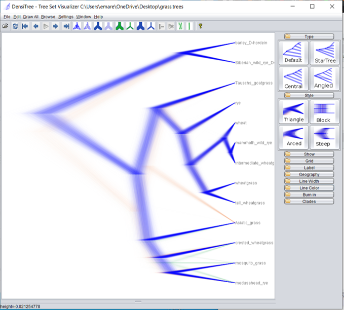
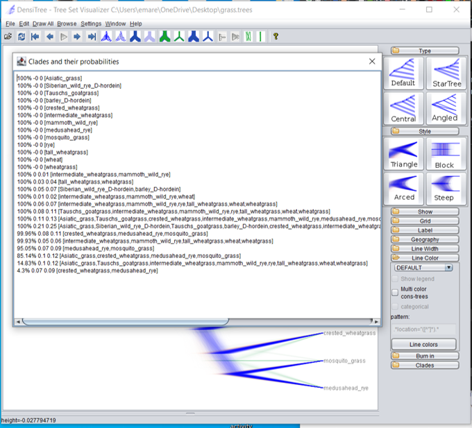
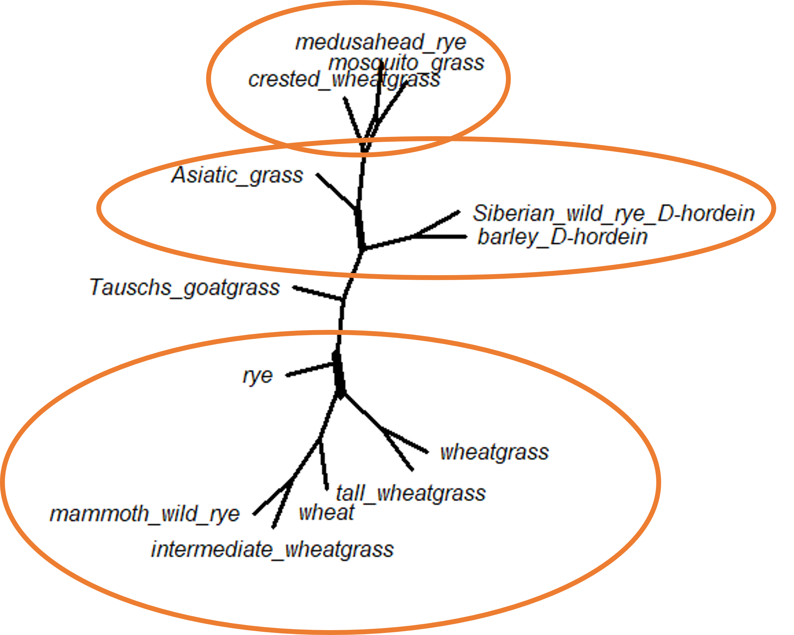
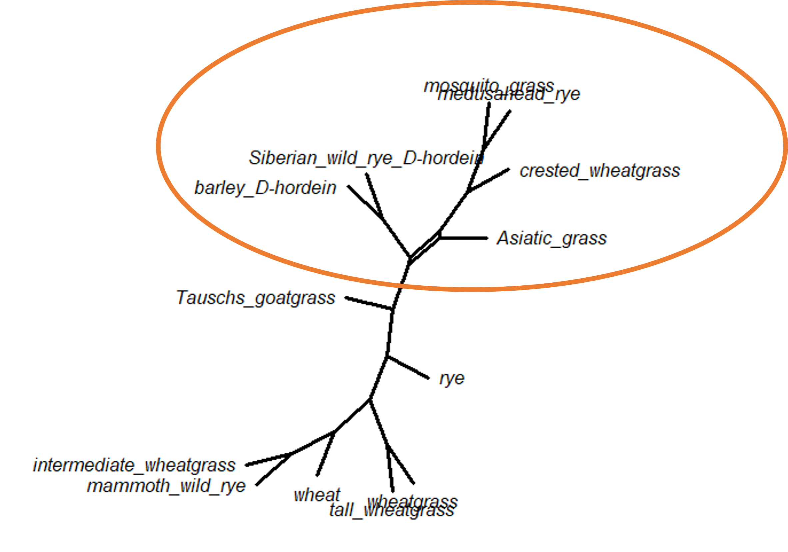

# (PART\*) PHYLOGENETIC NETWORKS {-}


# What is a network?

Phylogenetic networks (sometimes called the splits network) are a way to examine conflicting phylogenetic relationships in your data. Like a tree, networks visually represent evolutionary relationships among taxa. Unlike a tree, a network can show conflicting signals in the data, when multiple relationship patterns are supported. (A tree will simply show the relationship with the most data support.)

These types of analyses started gaining in popularity with the advent of big data in the mid 2000s, because researchers were discovering that not all genes within an organism had the same evolutionary history. Phenomena such as incomplete lineage sorting, gene loss or duplication, hybridization, or horizontal gene transfer mean that genes in an organism's genome can come from a variety of sources. Our simple understanding of speciation (a population splits in two, and the resulting daughter populations become genetically isolated from each other and develop into two new, different species) was no longer sufficient to describe what actually happens in nature. This is the essential idea behind the difference between gene trees and species trees.

Take a look at this figure (Daniel Huson, ISMB-Tutorial 2007: Introduction to Phylogenetic Networks)


Figure T1 and T2 represent possible phylogenetic relationships among taxa. Let's say 60% the data support the relationship in T1, while the other 40% of the data support the relationship in T2. If we were to use all the data together to infer a single consensus tree, we would only see the relationships in T1; the information in T2 would be completely obscured. A phylogenetic network, on the other hand, will show us both possible relationships (the diamond shape you see in the third figure). It's as if figure T1 was overlaid on figure T2 (with some extra branches drawn). In a network, the diamond shapes represent all the different possible phylogenetic relationships.

## Why do we see competing phylogenetic relationships?

The process of speciation is slow. While it sounds straightforward (a population splits into two reproductively isolated daughter populations, which then become two new species), in reality it is a very slow and messy process. Sometimes we are examining taxa that have only recently become separate. In this situation, we might be seeing the result of *_incomplete lineage sorting_*. When populations first split, there will be individuals within each daughter population who have the same allele for particular genes or genomic regions. Usually these shared alleles will sort, or become extinct in one population but not the other. However, this process takes time, and the bigger the daughter population, the longer this process takes.

If the two daughter populations have been separated long enough for genomic sorting to have occurred, the conflicting phylogenetic relationships could be the result of *_introgression_*. Among sexually reproductive species, members of two separate species might interbreed or hybridize (this is very common in some orders, especially ducks!). In bacteria, genes can be transferred between bacteria of different species via horizontal gene transfer. Viruses will also swap entire genes in a similar process. 

Finally, it may not be possible to reconstruct the phylogenetic relationships among groups if speciation happened over a very short time period (similar to what you expect in an adaptive radiation). In this case, the relationships among species might look like a polytomy instead of a series of bifurcating nodes.

::: {.dictionary}
**Gene trees and species trees**

One of the most important things to remember in phylogenetics is that we estimate gene trees. We often use these as proxies for species trees, but they are not the same thing. Due to the process of sorting and introgression, the phylogenetic relationships supported by a certain percentage of genes or genomic regions will actually _differ_ from the species tree. When you are looking at trees built with data from only one gene, you can't guarantee that your gene tree is reflective of the species tree!

This is problematic now that we're using whole genomes to infer phylogenies. The methods we use for inferring phylogenies were designed based on the idea that all the sequences evolved following a single model of evolution, with no complicating factors like lateral gene transfer, duplication events, or recombination. Unfortunately, the genome is a wild hodgepodge of coding regions, noncoding regions, introns, exons, regulatory regions, pseudogenes, and a bunch of other things we probably don't know about yet. Each of these regions may have their own evolutionary history that is best modeled by a variety of molecular models. 

There are two basic approaches to dealing with the whole genome mess. Both of these approaches are computationally complex and generally can only be done with neighbor joining or parsimony methods, at least for now. Researchers can consider each genomic region separately (the consensus gene tree approach), and then find an evolutionary history that best fits the distribution of topologies generated by each separate genomic region. Alternatively, researchers can "glue" the whole genome together into a single fasta file (the concatenation approach), which they then use for analysis, assuming you can figure out how to align the genomes. Gene duplication, gene deletion, and the presense of pseudogene regions make this a not-insignificant problem. 

When you are working with microbial genomes, you have the added difficulty of the pan-genome problem. In many bacteria, genes can generally be sorted into two groups: the core genes (genes that are present in all members of a species) and the accessory genes (genes that can be present, but don't have to be). The collection of all core genes plus all accessory genes is called the _pan-genome_. A typical _S. aureus_ genome is about 2800 genes (1000 core genes and 1800 accessory genes). Unfortunately, the _S. aureus_ pan-genome is a little more than 7400 genes. That means the 1800 accessory genes in any given _S. aureus_ genome are selected from 6400 possibilities. 

This should not discourage you from the possibility of building whole genome phylogenetic trees. New methods and programs are coming out all the time to deal with these problems, and trees from whole genome sequence are becoming a reality. If this is something you're interested in, take a look at programs like kSNP3.
:::

# Visualizing phylogenetic networks

We will be working with both the DensiTree application from BEAST and the `phangorn` package in R.

## Using DensiTree

When you ran your Bayesian analysis, you created a distribution of trees. You summarized this distribution when you looked at the posterior estimates of support for the nodes and clades, but there is a lot more information we can get from this distribution.

Open DensiTree on your personal computer. (DensiTree should have been installed when you downloaded BEAST.) Click on File, then Load and choose your .trees file that was created when you ran BEAST. All the trees in the distribution will be drawn in a fuzzy-looking tree. The darker the line, the more consensus there is among your tree distribution that the branch exists. 

In the grass example, we see branches in three separate colors - blue, orange, and green. (I changed the default colors by clicking on "Line Color" in the menu on the right side of the screen. If you open it and then open the "Line Colors" option, you can change your colors as well.) The blue branches are branches supported by the majority of the tree distribution, while the orange and green branches represent alternate branching patterns. 





The orange and green colors are very light because those alternate branching patterns show up in only a small percentage of the tree distribution. We can see the percentage if we click on "Help" and then "View Clades."





There's not much disagreement among the trees in the posterior distribution for our grass example. The main disagreement is with the placement of the Asiatic grass sample; 85% of the trees place Asiatic grass with the crested wheatgrass/medusahead rye/mosquito grass clade, which 15% place it in a different position. 

::: {.dictionary}

I have been using the words "probability" and "percentage" interchangeably when talking about the Bayesian posterior tree distribution. Although probability and percentage aren't usually the same thing, in this case they are. We are estimating the probability of topologies by calculating the percentage of the tree distribution with the desired topology.

:::


## Networks in R

`phangorn` offers an algorithm called `consensusNet` to visualize conflicting topological relationships from our data. This algorithm builds networks similar to the Huson example above using previously-generated analyses files. 

We have two options for our input. `consensusNet` takes a list of trees as the input (which R sees an an object of class `multiPhylo`), so we can either load the bootstrap trees from the ML analysis or the posterior distribution of trees from the Bayesian analysis. Here we will do both with the grass dataset so we can compare the networks. (Notice that we need to use two different commands to load the trees into R - the two tree files are saved in two separate formats. The ML trees are saved in Newick format, while the Bayesian trees are saved in Nexus format.)


``` r
library(phangorn)

grass.ml <- read.tree("grass_ml_bootstrap.tre")
grass.bayes <- read.nexus("grass_bayes.trees")
```

After we load our trees, we run the `consensusNet` command. This command takes two arguments. The first is the tree file, while the second is the bootstrap value threshold. For this example, we'll set the threshold at 0.1, meaning we will see all the possible nodes with at least a bootstrap support or posterior density of 0.1.


``` r
cnet.ml <- consensusNet(grass.ml, .1)
cnet.bayes <- consensusNet(grass.bayes, .1)

plot(cnet.ml, show.edge.label=TRUE)
```





We can see there are very few alternate topologies in the bootstrap trees (which we already knew would be the case, given the high bootstrap support in the original ML tree!), but there are a couple of splits. The first suggests that crested wheatgrass is sometimes in a polytomy with medusahead rye and mosquito grass, instead of splitting from that clade earlier. The second split suggests that some trees has Asiatic grass splitting from the main tree as the basal node and sometimes clusters with the crested wheatgrass/medusahead rye/mosquito grass clade. Finally, the last split changes the position of rye.


``` r
plot(cnet.bayes, show.edge.label=TRUE)
```





There is only one split in the Bayesian network - the placement of Asiatic grass taxon. We have seen this already in the DensiTree diagram, but it does look a bit different in network form. This particular split shows up in both the ML bootstrap network and the Bayesian posterior distribution network.

We can also add the support values for each split (the bootstrap values for the ML network, or the posterior probabilities for the Bayesian network) by changing the `show.edge.label` command to equal TRUE. Be careful, though, as this can make the network very difficult to read.


``` r
sessionInfo()
```

```
## R version 4.3.2 (2023-10-31)
## Platform: x86_64-pc-linux-gnu (64-bit)
## Running under: Ubuntu 22.04.4 LTS
## 
## Matrix products: default
## BLAS:   /usr/lib/x86_64-linux-gnu/openblas-pthread/libblas.so.3 
## LAPACK: /usr/lib/x86_64-linux-gnu/openblas-pthread/libopenblasp-r0.3.20.so;  LAPACK version 3.10.0
## 
## locale:
##  [1] LC_CTYPE=en_US.UTF-8       LC_NUMERIC=C              
##  [3] LC_TIME=en_US.UTF-8        LC_COLLATE=en_US.UTF-8    
##  [5] LC_MONETARY=en_US.UTF-8    LC_MESSAGES=en_US.UTF-8   
##  [7] LC_PAPER=en_US.UTF-8       LC_NAME=C                 
##  [9] LC_ADDRESS=C               LC_TELEPHONE=C            
## [11] LC_MEASUREMENT=en_US.UTF-8 LC_IDENTIFICATION=C       
## 
## time zone: Etc/UTC
## tzcode source: system (glibc)
## 
## attached base packages:
## [1] stats     graphics  grDevices utils     datasets  methods   base     
## 
## other attached packages:
## [1] phangorn_2.11.1 ape_5.7-1      
## 
## loaded via a namespace (and not attached):
##  [1] sass_0.4.8       utf8_1.2.4       generics_0.1.3   xml2_1.3.6      
##  [5] lattice_0.21-9   stringi_1.8.3    hms_1.1.3        digest_0.6.34   
##  [9] magrittr_2.0.3   grid_4.3.2       evaluate_0.23    timechange_0.3.0
## [13] bookdown_0.41    fastmap_1.1.1    Matrix_1.6-1.1   rprojroot_2.0.4 
## [17] jsonlite_1.8.8   processx_3.8.3   chromote_0.3.1   ps_1.7.6        
## [21] promises_1.2.1   httr_1.4.7       fansi_1.0.6      ottrpal_1.3.0   
## [25] codetools_0.2-19 jquerylib_0.1.4  cli_3.6.2        rlang_1.1.4     
## [29] cachem_1.0.8     yaml_2.3.8       parallel_4.3.2   tools_4.3.2     
## [33] tzdb_0.4.0       dplyr_1.1.4      fastmatch_1.1-4  vctrs_0.6.5     
## [37] R6_2.5.1         lifecycle_1.0.4  lubridate_1.9.3  snakecase_0.11.1
## [41] stringr_1.5.1    janitor_2.2.0    pkgconfig_2.0.3  pillar_1.9.0    
## [45] bslib_0.6.1      later_1.3.2      glue_1.7.0       Rcpp_1.0.12     
## [49] xfun_0.48        tibble_3.2.1     tidyselect_1.2.0 knitr_1.48      
## [53] igraph_2.0.2     nlme_3.1-164     htmltools_0.5.7  websocket_1.4.2 
## [57] rmarkdown_2.25   webshot2_0.1.1   readr_2.1.5      compiler_4.3.2  
## [61] quadprog_1.5-8   askpass_1.2.0    openssl_2.1.1
```

